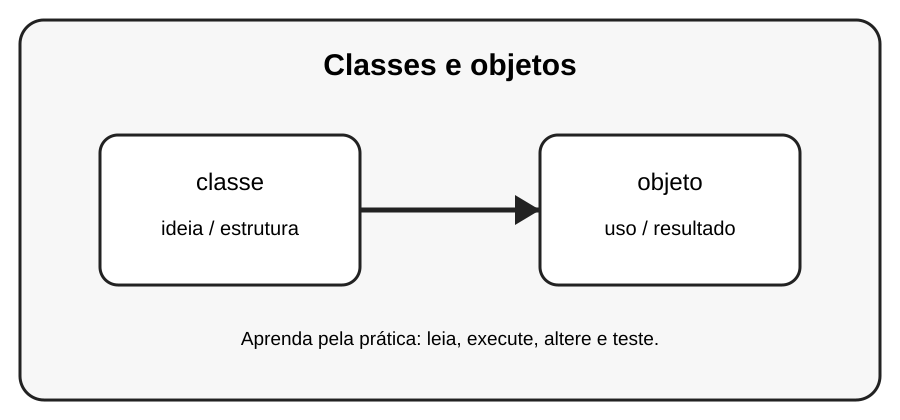

# Aula 1 — Classes e objetos

**Assinatura:** Domingos Ferraz Fonseca

## 1. Entendendo a ideia

Uma classe é como um molde. Um objeto é uma instância criada a partir desse molde.

## 2. Exemplo prático

~~~python
class Pessoa:
    pass

pessoa1 = Pessoa()
pessoa2 = Pessoa()
print(pessoa1)
print(pessoa2)
~~~

Observe o que acontece quando criamos e usamos os objetos. Não tente decorar tudo de uma vez: leia o código linha por linha.

## 3. Exercício guiado

Pratique a ideia principal usando **classe** e **objeto**. Primeiro copie o exemplo, depois altere nomes e valores e observe o resultado.

## 4. Exercícios

1. Crie uma classe Livro e dois objetos.
2. Crie uma classe Cachorro.
3. Explique classe e objeto com suas palavras.

## 5. Desafio

Crie um pequeno programa que use a ideia desta aula junto com pelo menos um conceito aprendido anteriormente. Teste o programa com valores diferentes.

## 6. Revisão

- Explique o conceito principal sem olhar o código.
- Execute o exemplo.
- Faça uma pequena alteração.
- Crie seu próprio exemplo.

