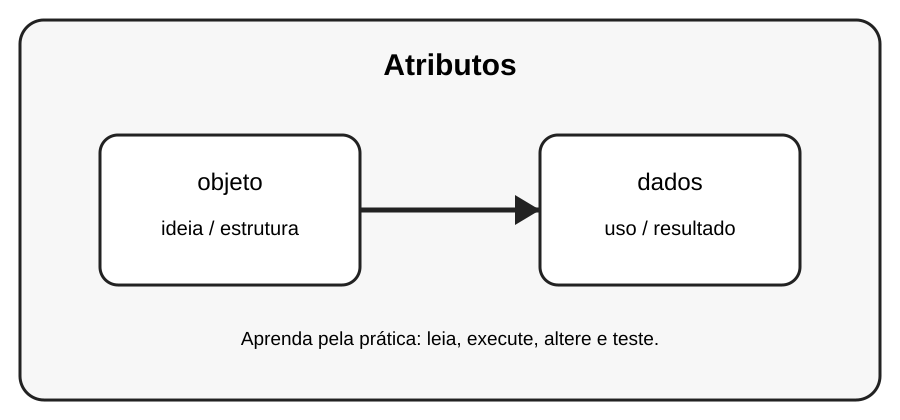

# Aula 2 — Atributos

**Assinatura:** Domingos Ferraz Fonseca

## 1. Entendendo a ideia

Um atributo é uma informação que pertence a um objeto.

## 2. Exemplo prático

~~~python
class Pessoa:
    pass

pessoa = Pessoa()
pessoa.nome = "Ana"
pessoa.idade = 12
print(pessoa.nome, pessoa.idade)
~~~

Observe o que acontece quando criamos e usamos os objetos. Não tente decorar tudo de uma vez: leia o código linha por linha.

## 3. Exercício guiado

Pratique a ideia principal usando **objeto** e **dados**. Primeiro copie o exemplo, depois altere nomes e valores e observe o resultado.

## 4. Exercícios

1. Crie Carro com marca e modelo.
2. Crie Aluno com nome e nota.
3. Crie três objetos com dados diferentes.

## 5. Desafio

Crie um pequeno programa que use a ideia desta aula junto com pelo menos um conceito aprendido anteriormente. Teste o programa com valores diferentes.

## 6. Revisão

- Explique o conceito principal sem olhar o código.
- Execute o exemplo.
- Faça uma pequena alteração.
- Crie seu próprio exemplo.

