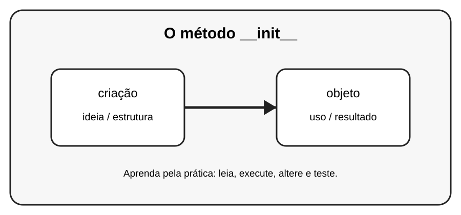

# Aula 3 — O método __init__

**Assinatura:** Domingos Ferraz Fonseca

## 1. Entendendo a ideia

O método __init__ prepara o objeto quando ele é criado. self representa o objeto atual.

## 2. Exemplo prático

~~~python
class Pessoa:
    def __init__(self, nome, idade):
        self.nome = nome
        self.idade = idade

pessoa = Pessoa("Ana", 12)
print(pessoa.nome, pessoa.idade)
~~~

Observe o que acontece quando criamos e usamos os objetos. Não tente decorar tudo de uma vez: leia o código linha por linha.

## 3. Exercício guiado

Pratique a ideia principal usando **criação** e **objeto**. Primeiro copie o exemplo, depois altere nomes e valores e observe o resultado.

## 4. Exercícios

1. Crie Produto(nome, preco).
2. Crie Livro(titulo, autor).
3. Crie dois objetos de cada classe.

## 5. Desafio

Crie um pequeno programa que use a ideia desta aula junto com pelo menos um conceito aprendido anteriormente. Teste o programa com valores diferentes.

## 6. Revisão

- Explique o conceito principal sem olhar o código.
- Execute o exemplo.
- Faça uma pequena alteração.
- Crie seu próprio exemplo.

