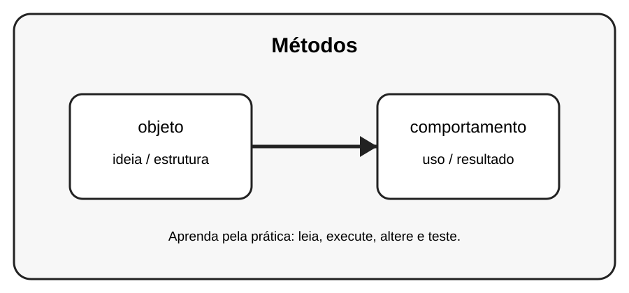

# Aula 4 — Métodos

**Assinatura:** Domingos Ferraz Fonseca

## 1. Entendendo a ideia

Um método é uma função definida dentro de uma classe e representa um comportamento.

## 2. Exemplo prático

~~~python
class Pessoa:
    def __init__(self, nome):
        self.nome = nome
    def apresentar(self):
        print("Olá! Eu sou", self.nome)

Pessoa("Ana").apresentar()
~~~

Observe o que acontece quando criamos e usamos os objetos. Não tente decorar tudo de uma vez: leia o código linha por linha.

## 3. Exercício guiado

Pratique a ideia principal usando **objeto** e **comportamento**. Primeiro copie o exemplo, depois altere nomes e valores e observe o resultado.

## 4. Exercícios

1. Crie Carro com buzinar().
2. Crie Aluno com mostrar_nome().
3. Crie Calculadora com somar().

## 5. Desafio

Crie um pequeno programa que use a ideia desta aula junto com pelo menos um conceito aprendido anteriormente. Teste o programa com valores diferentes.

## 6. Revisão

- Explique o conceito principal sem olhar o código.
- Execute o exemplo.
- Faça uma pequena alteração.
- Crie seu próprio exemplo.

