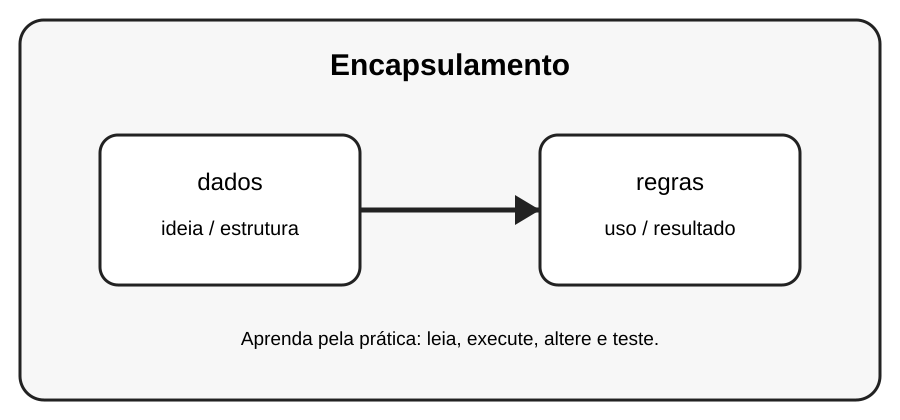

# Aula 5 — Encapsulamento

**Assinatura:** Domingos Ferraz Fonseca

## 1. Entendendo a ideia

Encapsulamento ajuda a organizar o acesso aos dados e as regras que os protegem. Em Python, _nome é principalmente uma convenção.

## 2. Exemplo prático

~~~python
class Conta:
    def __init__(self):
        self._saldo = 0
    def depositar(self, valor):
        if valor > 0:
            self._saldo += valor
    def mostrar_saldo(self):
        return self._saldo

conta = Conta()
conta.depositar(50)
print(conta.mostrar_saldo())
~~~

Observe o que acontece quando criamos e usamos os objetos. Não tente decorar tudo de uma vez: leia o código linha por linha.

## 3. Exercício guiado

Pratique a ideia principal usando **dados** e **regras**. Primeiro copie o exemplo, depois altere nomes e valores e observe o resultado.

## 4. Exercícios

1. Crie Produto com _preco.
2. Valide um valor antes de alterá-lo.
3. Crie uma Conta com depósito seguro.

## 5. Desafio

Crie um pequeno programa que use a ideia desta aula junto com pelo menos um conceito aprendido anteriormente. Teste o programa com valores diferentes.

## 6. Revisão

- Explique o conceito principal sem olhar o código.
- Execute o exemplo.
- Faça uma pequena alteração.
- Crie seu próprio exemplo.

