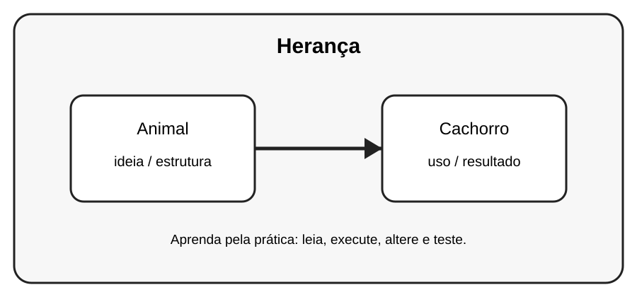

# Aula 6 — Herança

**Assinatura:** Domingos Ferraz Fonseca

## 1. Entendendo a ideia

Herança permite criar uma classe nova aproveitando comportamentos de uma classe existente.

## 2. Exemplo prático

~~~python
class Animal:
    def falar(self):
        print("Som")

class Cachorro(Animal):
    pass

Cachorro().falar()
~~~

Observe o que acontece quando criamos e usamos os objetos. Não tente decorar tudo de uma vez: leia o código linha por linha.

## 3. Exercício guiado

Pratique a ideia principal usando **Animal** e **Cachorro**. Primeiro copie o exemplo, depois altere nomes e valores e observe o resultado.

## 4. Exercícios

1. Crie Pessoa e Aluno(Pessoa).
2. Crie Animal e Gato(Animal).
3. Adicione um método exclusivo à classe filha.

## 5. Desafio

Crie um pequeno programa que use a ideia desta aula junto com pelo menos um conceito aprendido anteriormente. Teste o programa com valores diferentes.

## 6. Revisão

- Explique o conceito principal sem olhar o código.
- Execute o exemplo.
- Faça uma pequena alteração.
- Crie seu próprio exemplo.

