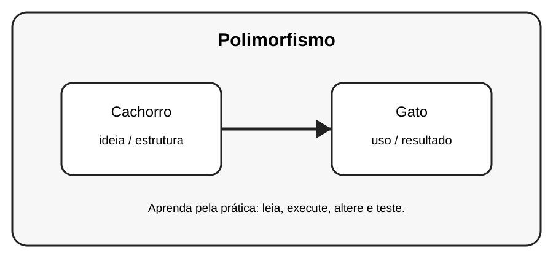

# Aula 7 — Polimorfismo

**Assinatura:** Domingos Ferraz Fonseca

## 1. Entendendo a ideia

Polimorfismo permite que objetos diferentes respondam à mesma operação de formas diferentes.

## 2. Exemplo prático

~~~python
class Cachorro:
    def falar(self):
        print("Au au!")
class Gato:
    def falar(self):
        print("Miau!")

for animal in [Cachorro(), Gato()]:
    animal.falar()
~~~

Observe o que acontece quando criamos e usamos os objetos. Não tente decorar tudo de uma vez: leia o código linha por linha.

## 3. Exercício guiado

Pratique a ideia principal usando **Cachorro** e **Gato**. Primeiro copie o exemplo, depois altere nomes e valores e observe o resultado.

## 4. Exercícios

1. Crie duas classes com o mesmo método.
2. Dê comportamentos diferentes a cada uma.
3. Use um for para chamar o método.

## 5. Desafio

Crie um pequeno programa que use a ideia desta aula junto com pelo menos um conceito aprendido anteriormente. Teste o programa com valores diferentes.

## 6. Revisão

- Explique o conceito principal sem olhar o código.
- Execute o exemplo.
- Faça uma pequena alteração.
- Crie seu próprio exemplo.

