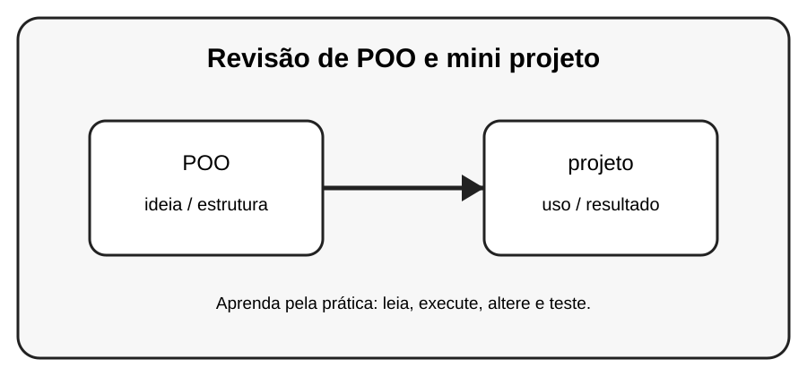

# Aula 8 — Revisão de POO e mini projeto

**Assinatura:** Domingos Ferraz Fonseca

## 1. Entendendo a ideia

Nesta revisão reunimos classes, objetos, atributos, __init__, self, métodos, encapsulamento, herança e polimorfismo.

## 2. Exemplo prático

~~~python
class Aluno:
    def __init__(self, nome, nota):
        self.nome = nome
        self.nota = nota
    def aprovado(self):
        return self.nota >= 10
    def mostrar(self):
        estado = "Aprovado" if self.aprovado() else "Reprovado"
        print(self.nome, self.nota, estado)

for aluno in [Aluno("Ana", 15), Aluno("Rui", 9)]:
    aluno.mostrar()
~~~

Observe o que acontece quando criamos e usamos os objetos. Não tente decorar tudo de uma vez: leia o código linha por linha.

## 3. Exercício guiado

Pratique a ideia principal usando **POO** e **projeto**. Primeiro copie o exemplo, depois altere nomes e valores e observe o resultado.

## 4. Exercícios

1. Crie Livro com título e autor.
2. Crie três livros em uma lista.
3. Crie uma Biblioteca que liste os livros.

## 5. Desafio

Crie um pequeno programa que use a ideia desta aula junto com pelo menos um conceito aprendido anteriormente. Teste o programa com valores diferentes.

## 6. Revisão

- Explique o conceito principal sem olhar o código.
- Execute o exemplo.
- Faça uma pequena alteração.
- Crie seu próprio exemplo.

