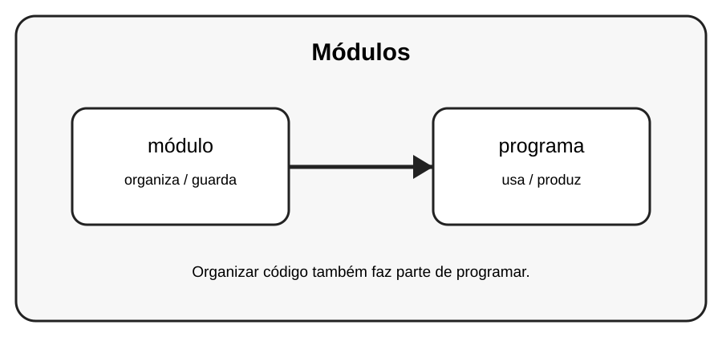

# Aula 1 — Módulos

**Assinatura:** Domingos Ferraz Fonseca

## 1. Entendendo a ideia

Um módulo é um arquivo Python que reúne código relacionado. Isso ajuda a dividir programas grandes em partes menores.

## 2. Exemplo prático

~~~python
import math
print(math.sqrt(25))
~~~

Leia o exemplo devagar. Depois execute e faça uma pequena alteração para descobrir o que muda.

## 3. Exercício guiado

1. Importe math. 2. Use uma função de math. 3. Crie um arquivo módulo.py simples.

## 4. Exercícios

1. Explique com suas palavras para que serve módulo.
2. Faça uma pequena alteração no exemplo.
3. Crie um exemplo próprio usando programa.

## 5. Desafio

Crie um módulo com três funções matemáticas.

## 6. Revisão

- O que foi aprendido nesta aula?
- Qual linha do exemplo é mais importante?
- O que acontece se você mudar um valor?
- Consegue criar um exemplo sem copiar?

