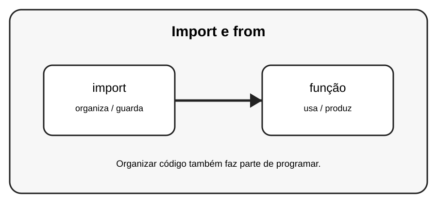

# Aula 2 — Import e from

**Assinatura:** Domingos Ferraz Fonseca

## 1. Entendendo a ideia

import permite trazer código de outro módulo. Também podemos importar apenas nomes específicos com from.

## 2. Exemplo prático

~~~python
from math import sqrt
print(sqrt(36))
~~~

Leia o exemplo devagar. Depois execute e faça uma pequena alteração para descobrir o que muda.

## 3. Exercício guiado

1. Use import math. 2. Depois teste from math import sqrt. 3. Compare as duas formas.

## 4. Exercícios

1. Explique com suas palavras para que serve import.
2. Faça uma pequena alteração no exemplo.
3. Crie um exemplo próprio usando função.

## 5. Desafio

Crie um programa que importe duas funções de um módulo.

## 6. Revisão

- O que foi aprendido nesta aula?
- Qual linha do exemplo é mais importante?
- O que acontece se você mudar um valor?
- Consegue criar um exemplo sem copiar?

