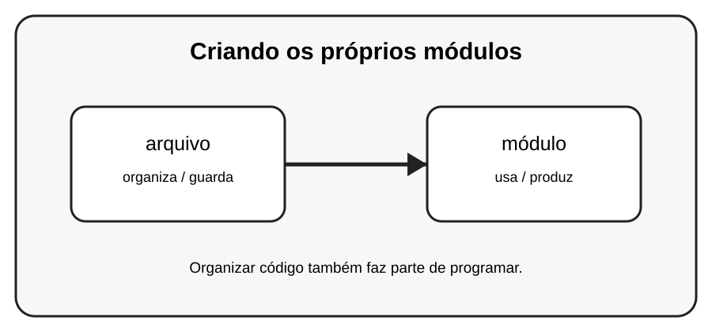

# Aula 3 — Criando os próprios módulos

**Assinatura:** Domingos Ferraz Fonseca

## 1. Entendendo a ideia

Você pode criar seus próprios módulos. Um arquivo calculos.py pode guardar funções e outro arquivo pode usá-las.

## 2. Exemplo prático

~~~python
# calculos.py
def dobro(n):
    return n * 2

# principal.py
import calculos
print(calculos.dobro(5))
~~~

Leia o exemplo devagar. Depois execute e faça uma pequena alteração para descobrir o que muda.

## 3. Exercício guiado

1. Crie calculos.py. 2. Coloque uma função nele. 3. Importe essa função em outro arquivo.

## 4. Exercícios

1. Explique com suas palavras para que serve arquivo.
2. Faça uma pequena alteração no exemplo.
3. Crie um exemplo próprio usando módulo.

## 5. Desafio

Crie dois módulos que trabalhem juntos.

## 6. Revisão

- O que foi aprendido nesta aula?
- Qual linha do exemplo é mais importante?
- O que acontece se você mudar um valor?
- Consegue criar um exemplo sem copiar?

