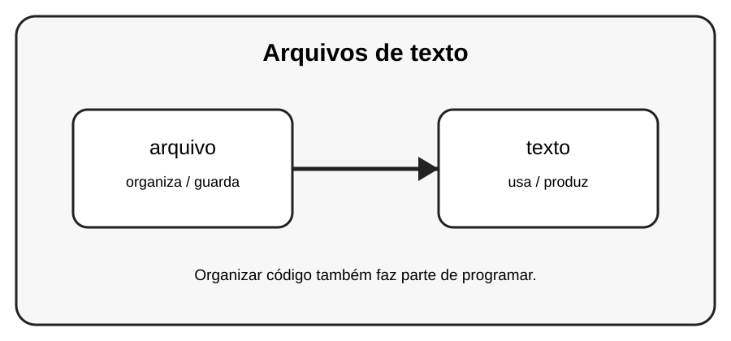

# Aula 4 — Arquivos de texto

**Assinatura:** Domingos Ferraz Fonseca

## 1. Entendendo a ideia

Arquivos de texto permitem guardar informações para usar depois que o programa termina. Python pode ler e escrever esses arquivos.

## 2. Exemplo prático

~~~python
arquivo = open("recado.txt", "w", encoding="utf-8")
arquivo.write("Olá, Python!")
arquivo.close()
~~~

Leia o exemplo devagar. Depois execute e faça uma pequena alteração para descobrir o que muda.

## 3. Exercício guiado

1. Crie um arquivo. 2. Escreva uma frase. 3. Abra-o novamente para leitura.

## 4. Exercícios

1. Explique com suas palavras para que serve arquivo.
2. Faça uma pequena alteração no exemplo.
3. Crie um exemplo próprio usando texto.

## 5. Desafio

Guarde uma pequena lista de tarefas em um arquivo.

## 6. Revisão

- O que foi aprendido nesta aula?
- Qual linha do exemplo é mais importante?
- O que acontece se você mudar um valor?
- Consegue criar um exemplo sem copiar?

