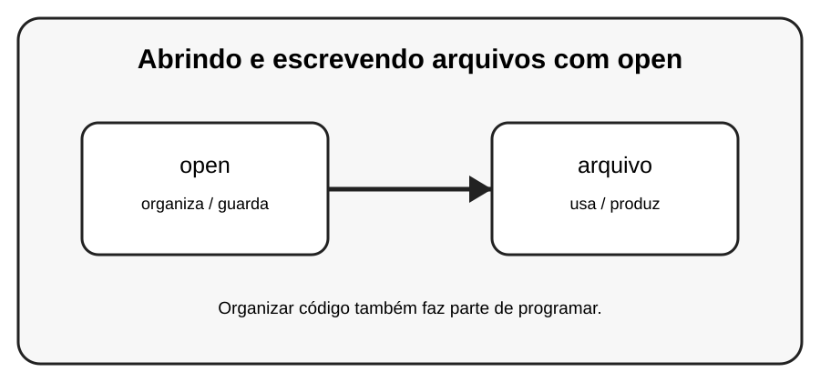

# Aula 5 — Abrindo e escrevendo arquivos com open

**Assinatura:** Domingos Ferraz Fonseca

## 1. Entendendo a ideia

A função open() abre um arquivo. O modo "r" lê, "w" escreve substituindo o conteúdo e "a" acrescenta conteúdo.

## 2. Exemplo prático

~~~python
with open("notas.txt", "r", encoding="utf-8") as arquivo:
    conteudo = arquivo.read()
    print(conteudo)
~~~

Leia o exemplo devagar. Depois execute e faça uma pequena alteração para descobrir o que muda.

## 3. Exercício guiado

1. Teste r, w e a. 2. Use with. 3. Observe quando o conteúdo é substituído ou acrescentado.

## 4. Exercícios

1. Explique com suas palavras para que serve open.
2. Faça uma pequena alteração no exemplo.
3. Crie um exemplo próprio usando arquivo.

## 5. Desafio

Crie um diário simples que acrescente uma nova linha a cada execução.

## 6. Revisão

- O que foi aprendido nesta aula?
- Qual linha do exemplo é mais importante?
- O que acontece se você mudar um valor?
- Consegue criar um exemplo sem copiar?

