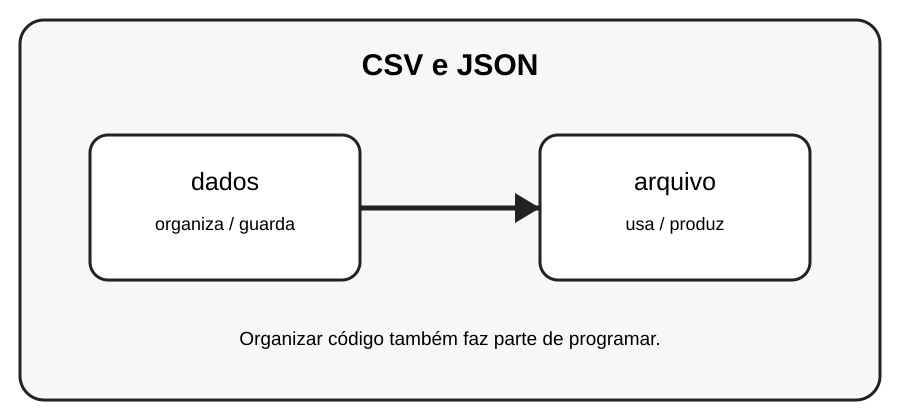

# Aula 6 — CSV e JSON

**Assinatura:** Domingos Ferraz Fonseca

## 1. Entendendo a ideia

CSV é útil para dados em linhas e colunas. JSON é muito usado para representar dados estruturados e trocar informações entre programas.

## 2. Exemplo prático

~~~python
import json

aluno = {"nome": "Ana", "nota": 15}
texto = json.dumps(aluno, ensure_ascii=False)
print(texto)
~~~

Leia o exemplo devagar. Depois execute e faça uma pequena alteração para descobrir o que muda.

## 3. Exercício guiado

1. Crie um dicionário. 2. Converta para JSON. 3. Converta JSON de volta para Python.

## 4. Exercícios

1. Explique com suas palavras para que serve dados.
2. Faça uma pequena alteração no exemplo.
3. Crie um exemplo próprio usando arquivo.

## 5. Desafio

Guarde uma lista de alunos em JSON.

## 6. Revisão

- O que foi aprendido nesta aula?
- Qual linha do exemplo é mais importante?
- O que acontece se você mudar um valor?
- Consegue criar um exemplo sem copiar?

