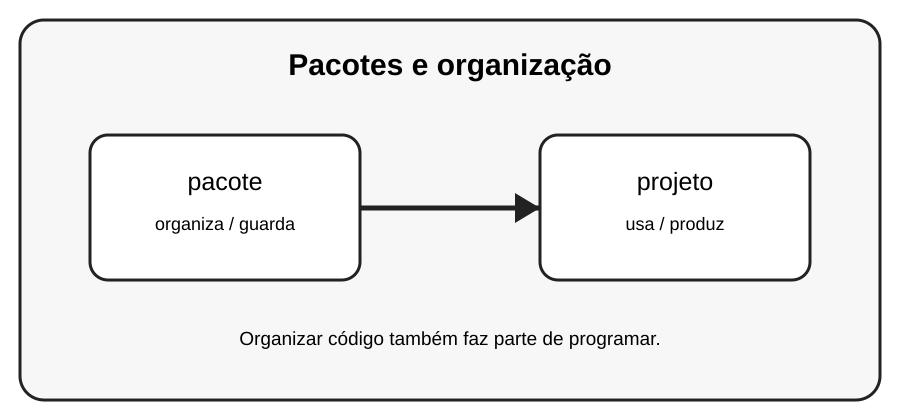

# Aula 7 — Pacotes e organização

**Assinatura:** Domingos Ferraz Fonseca

## 1. Entendendo a ideia

Um pacote organiza vários módulos em uma estrutura de pastas. Essa organização facilita projetos maiores.

## 2. Exemplo prático

~~~python
meu_projeto/
    main.py
    ferramentas/
        calculos.py
        textos.py
~~~

Leia o exemplo devagar. Depois execute e faça uma pequena alteração para descobrir o que muda.

## 3. Exercício guiado

1. Imagine uma pasta de projeto. 2. Separe funções por responsabilidade. 3. Pense em nomes claros para os módulos.

## 4. Exercícios

1. Explique com suas palavras para que serve pacote.
2. Faça uma pequena alteração no exemplo.
3. Crie um exemplo próprio usando projeto.

## 5. Desafio

Planeje um pacote para uma pequena loja.

## 6. Revisão

- O que foi aprendido nesta aula?
- Qual linha do exemplo é mais importante?
- O que acontece se você mudar um valor?
- Consegue criar um exemplo sem copiar?

