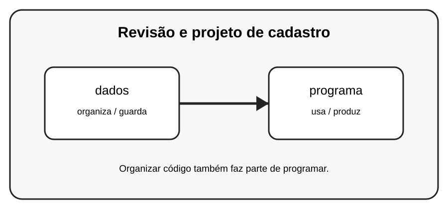

# Aula 8 — Revisão e projeto de cadastro

**Assinatura:** Domingos Ferraz Fonseca

## 1. Entendendo a ideia

Agora vamos juntar módulos, funções, listas, dicionários e arquivos para criar um pequeno cadastro persistente.

## 2. Exemplo prático

~~~python
alunos = [{"nome": "Ana", "nota": 15}, {"nome": "Rui", "nota": 9}]
for aluno in alunos:
    print(aluno["nome"], aluno["nota"])
~~~

Leia o exemplo devagar. Depois execute e faça uma pequena alteração para descobrir o que muda.

## 3. Exercício guiado

1. Crie cadastros. 2. Liste-os. 3. Salve os dados. 4. Leia os dados novamente.

## 4. Exercícios

1. Explique com suas palavras para que serve dados.
2. Faça uma pequena alteração no exemplo.
3. Crie um exemplo próprio usando programa.

## 5. Desafio

Transforme o cadastro em um pequeno sistema completo.

## 6. Revisão

- O que foi aprendido nesta aula?
- Qual linha do exemplo é mais importante?
- O que acontece se você mudar um valor?
- Consegue criar um exemplo sem copiar?

