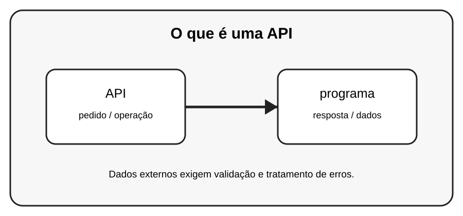

# Aula 1 — O que é uma API

**Assinatura:** Domingos Ferraz Fonseca

## 1. Entendendo a ideia

Uma API é uma forma organizada de um programa conversar com outro programa. Pense nela como um atendente: você faz um pedido e recebe uma resposta.

## 2. Exemplo prático

~~~python
# Exemplo conceitual
pedido = "Quero os dados de um produto"
resposta = "Aqui estão os dados do produto"
print(resposta)
~~~

> **Nota:** URLs e serviços externos podem mudar. Use APIs de teste ou documentação oficial quando executar os exemplos.

## 3. Exercício guiado

1. Explique API com a ideia de atendente. 2. Dê dois exemplos de sistemas que poderiam conversar por uma API. 3. Diferencie API e interface visual.

## 4. Exercícios

1. Explique o conceito principal com suas próprias palavras.
2. Faça uma pequena alteração no exemplo.
3. Crie um exemplo relacionado com uma situação do dia a dia.
4. Registe o resultado que observou.

## 5. Desafio

Desenhe no papel uma API entre uma loja e um aplicativo.

## 6. Boas práticas

- Leia a documentação da biblioteca ou API usada.
- Não coloque senhas ou chaves secretas diretamente no código.
- Valide dados recebidos de fontes externas.
- Trate erros de rede e de banco de dados.
- Faça cópias de segurança dos dados importantes.

## 7. Revisão

- O que você aprendeu?
- Que parte ainda parece difícil?
- Consegue explicar o conceito sem olhar o exemplo?
- Consegue modificar o código com segurança?

