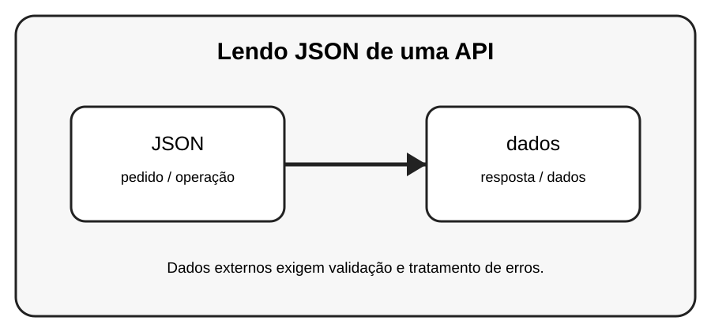

# Aula 3 — Lendo JSON de uma API

**Assinatura:** Domingos Ferraz Fonseca

## 1. Entendendo a ideia

Muitas APIs devolvem JSON. Em Python, uma resposta JSON pode virar dicionários e listas, facilitando o processamento.

## 2. Exemplo prático

~~~python
import requests

resposta = requests.get("https://example.com")
print(resposta.text)
~~~

> **Nota:** URLs e serviços externos podem mudar. Use APIs de teste ou documentação oficial quando executar os exemplos.

## 3. Exercício guiado

1. Descubra a diferença entre texto e JSON. 2. Pratique acessar chaves de um dicionário JSON. 3. Converta dados entre Python e JSON.

## 4. Exercícios

1. Explique o conceito principal com suas próprias palavras.
2. Faça uma pequena alteração no exemplo.
3. Crie um exemplo relacionado com uma situação do dia a dia.
4. Registe o resultado que observou.

## 5. Desafio

Monte um pequeno programa que receba dados JSON e mostre campos escolhidos.

## 6. Boas práticas

- Leia a documentação da biblioteca ou API usada.
- Não coloque senhas ou chaves secretas diretamente no código.
- Valide dados recebidos de fontes externas.
- Trate erros de rede e de banco de dados.
- Faça cópias de segurança dos dados importantes.

## 7. Revisão

- O que você aprendeu?
- Que parte ainda parece difícil?
- Consegue explicar o conceito sem olhar o exemplo?
- Consegue modificar o código com segurança?

