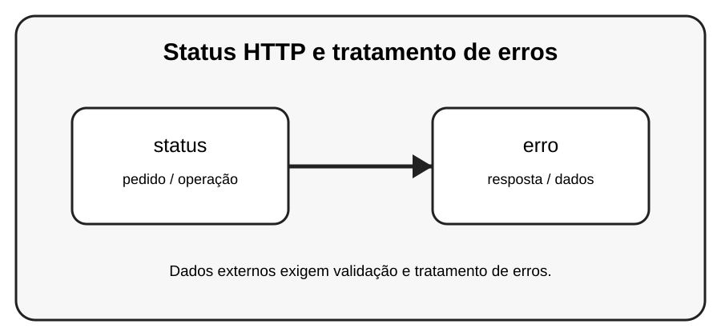

# Aula 4 — Status HTTP e tratamento de erros

**Assinatura:** Domingos Ferraz Fonseca

## 1. Entendendo a ideia

HTTP usa códigos de status para indicar o resultado de um pedido. Por exemplo, 200 indica sucesso e códigos 4xx ou 5xx indicam problemas de diferentes tipos.

## 2. Exemplo prático

~~~python
status = 200

if status == 200:
    print("Pedido realizado com sucesso")
else:
    print("Foi encontrado um problema")
~~~

> **Nota:** URLs e serviços externos podem mudar. Use APIs de teste ou documentação oficial quando executar os exemplos.

## 3. Exercício guiado

1. Pesquise no material o significado de 200, 404 e 500. 2. Crie condições para esses casos. 3. Pense em uma mensagem útil para o utilizador.

## 4. Exercícios

1. Explique o conceito principal com suas próprias palavras.
2. Faça uma pequena alteração no exemplo.
3. Crie um exemplo relacionado com uma situação do dia a dia.
4. Registe o resultado que observou.

## 5. Desafio

Crie uma função que trate pelo menos três grupos de status HTTP.

## 6. Boas práticas

- Leia a documentação da biblioteca ou API usada.
- Não coloque senhas ou chaves secretas diretamente no código.
- Valide dados recebidos de fontes externas.
- Trate erros de rede e de banco de dados.
- Faça cópias de segurança dos dados importantes.

## 7. Revisão

- O que você aprendeu?
- Que parte ainda parece difícil?
- Consegue explicar o conceito sem olhar o exemplo?
- Consegue modificar o código com segurança?

