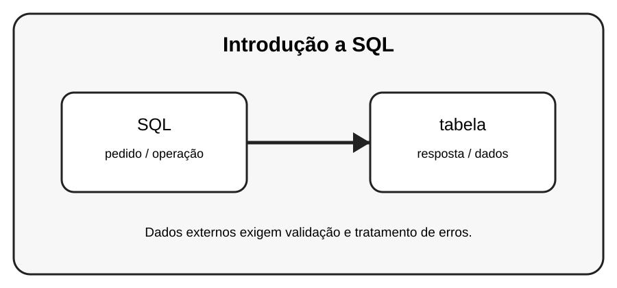

# Aula 5 — Introdução a SQL

**Assinatura:** Domingos Ferraz Fonseca

## 1. Entendendo a ideia

SQL é uma linguagem usada para trabalhar com dados organizados em tabelas. Antes de programar com bancos, é importante entender SELECT, INSERT, UPDATE e DELETE.

## 2. Exemplo prático

~~~python
SELECT nome, idade FROM alunos;

INSERT INTO alunos (nome, idade)
VALUES ('Ana', 12);
~~~

> **Nota:** URLs e serviços externos podem mudar. Use APIs de teste ou documentação oficial quando executar os exemplos.

## 3. Exercício guiado

1. Identifique tabela, coluna e linha. 2. Escreva um SELECT. 3. Escreva um INSERT. 4. Explique UPDATE e DELETE.

## 4. Exercícios

1. Explique o conceito principal com suas próprias palavras.
2. Faça uma pequena alteração no exemplo.
3. Crie um exemplo relacionado com uma situação do dia a dia.
4. Registe o resultado que observou.

## 5. Desafio

Crie no papel uma tabela de alunos e escreva cinco consultas SQL.

## 6. Boas práticas

- Leia a documentação da biblioteca ou API usada.
- Não coloque senhas ou chaves secretas diretamente no código.
- Valide dados recebidos de fontes externas.
- Trate erros de rede e de banco de dados.
- Faça cópias de segurança dos dados importantes.

## 7. Revisão

- O que você aprendeu?
- Que parte ainda parece difícil?
- Consegue explicar o conceito sem olhar o exemplo?
- Consegue modificar o código com segurança?

