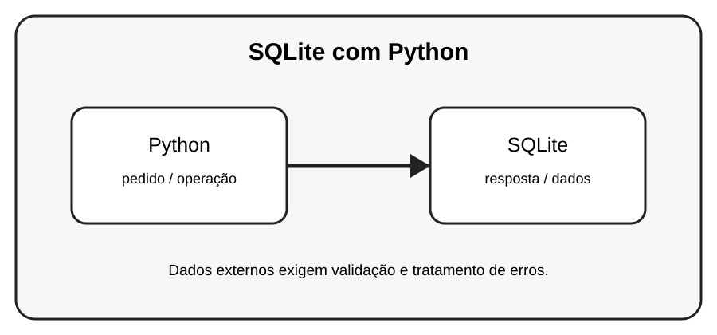

# Aula 6 — SQLite com Python

**Assinatura:** Domingos Ferraz Fonseca

## 1. Entendendo a ideia

SQLite é um banco de dados leve que pode ficar em um único arquivo. Python possui o módulo sqlite3 para trabalhar com ele.

## 2. Exemplo prático

~~~python
import sqlite3

conexao = sqlite3.connect("escola.db")
conexao.execute("CREATE TABLE IF NOT EXISTS alunos (id INTEGER PRIMARY KEY, nome TEXT)")
conexao.commit()
conexao.close()
~~~

> **Nota:** URLs e serviços externos podem mudar. Use APIs de teste ou documentação oficial quando executar os exemplos.

## 3. Exercício guiado

1. Crie um banco SQLite. 2. Crie uma tabela. 3. Insira um registro. 4. Consulte o registro.

## 4. Exercícios

1. Explique o conceito principal com suas próprias palavras.
2. Faça uma pequena alteração no exemplo.
3. Crie um exemplo relacionado com uma situação do dia a dia.
4. Registe o resultado que observou.

## 5. Desafio

Crie uma tabela de produtos usando SQLite.

## 6. Boas práticas

- Leia a documentação da biblioteca ou API usada.
- Não coloque senhas ou chaves secretas diretamente no código.
- Valide dados recebidos de fontes externas.
- Trate erros de rede e de banco de dados.
- Faça cópias de segurança dos dados importantes.

## 7. Revisão

- O que você aprendeu?
- Que parte ainda parece difícil?
- Consegue explicar o conceito sem olhar o exemplo?
- Consegue modificar o código com segurança?

