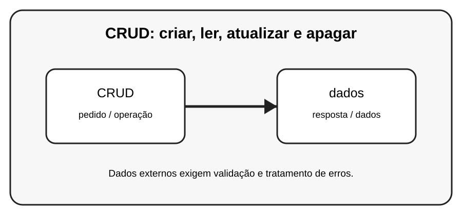

# Aula 7 — CRUD: criar, ler, atualizar e apagar

**Assinatura:** Domingos Ferraz Fonseca

## 1. Entendendo a ideia

CRUD representa quatro operações básicas: Create, Read, Update e Delete. Elas aparecem em praticamente todo sistema que guarda dados.

## 2. Exemplo prático

~~~python
CREATE = criar
READ = ler
UPDATE = atualizar
DELETE = apagar

print("CRUD organiza as operações sobre dados")
~~~

> **Nota:** URLs e serviços externos podem mudar. Use APIs de teste ou documentação oficial quando executar os exemplos.

## 3. Exercício guiado

1. Relacione cada letra a uma operação. 2. Faça um INSERT e SELECT. 3. Depois pratique UPDATE e DELETE com cuidado.

## 4. Exercícios

1. Explique o conceito principal com suas próprias palavras.
2. Faça uma pequena alteração no exemplo.
3. Crie um exemplo relacionado com uma situação do dia a dia.
4. Registe o resultado que observou.

## 5. Desafio

Construa um CRUD completo para alunos ou produtos.

## 6. Boas práticas

- Leia a documentação da biblioteca ou API usada.
- Não coloque senhas ou chaves secretas diretamente no código.
- Valide dados recebidos de fontes externas.
- Trate erros de rede e de banco de dados.
- Faça cópias de segurança dos dados importantes.

## 7. Revisão

- O que você aprendeu?
- Que parte ainda parece difícil?
- Consegue explicar o conceito sem olhar o exemplo?
- Consegue modificar o código com segurança?

