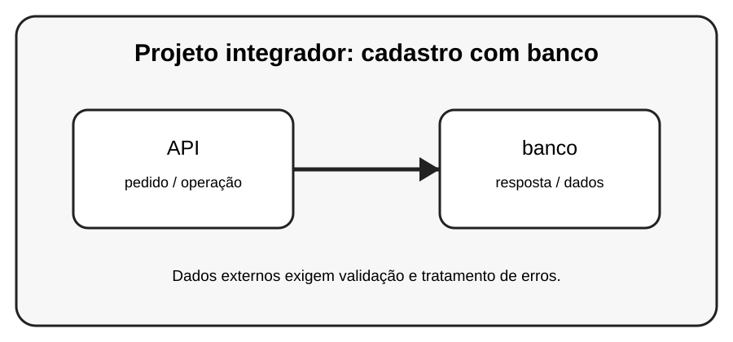

# Aula 8 — Projeto integrador: cadastro com banco

**Assinatura:** Domingos Ferraz Fonseca

## 1. Entendendo a ideia

Um projeto real pode juntar entrada de dados, funções, banco SQLite e comunicação com uma API. O objetivo é organizar cada responsabilidade em partes claras.

## 2. Exemplo prático

~~~python
# Estrutura sugerida
projeto/
    main.py
    banco.py
    api.py
    modelos.py
~~~

> **Nota:** URLs e serviços externos podem mudar. Use APIs de teste ou documentação oficial quando executar os exemplos.

## 3. Exercício guiado

1. Separe o projeto em módulos. 2. Crie uma tabela. 3. Faça um cadastro. 4. Adicione uma consulta a uma API de teste.

## 4. Exercícios

1. Explique o conceito principal com suas próprias palavras.
2. Faça uma pequena alteração no exemplo.
3. Crie um exemplo relacionado com uma situação do dia a dia.
4. Registe o resultado que observou.

## 5. Desafio

Crie um pequeno sistema de cadastro que guarde dados no SQLite e consulte uma API.

## 6. Boas práticas

- Leia a documentação da biblioteca ou API usada.
- Não coloque senhas ou chaves secretas diretamente no código.
- Valide dados recebidos de fontes externas.
- Trate erros de rede e de banco de dados.
- Faça cópias de segurança dos dados importantes.

## 7. Revisão

- O que você aprendeu?
- Que parte ainda parece difícil?
- Consegue explicar o conceito sem olhar o exemplo?
- Consegue modificar o código com segurança?

