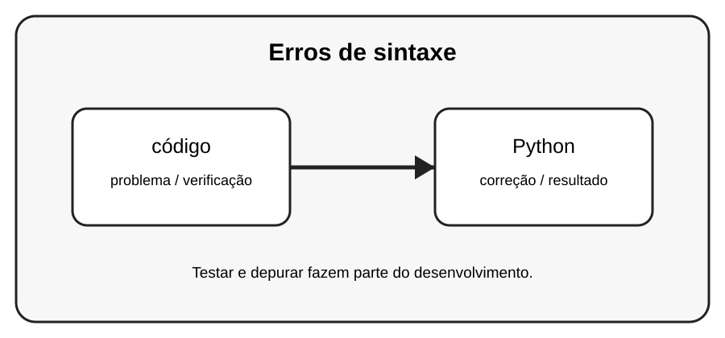

# Aula 1 — Erros de sintaxe

**Assinatura:** Domingos Ferraz Fonseca

## 1. Entendendo a ideia

Um erro de sintaxe acontece quando o código não segue as regras da linguagem. O Python normalmente aponta a linha onde encontrou o problema.

## 2. Exemplo prático

~~~python
print("Olá"
~~~

Leia a mensagem de erro com calma. Um erro não é uma derrota: é uma pista que ajuda a descobrir o que precisa ser corrigido.

## 3. Exercício guiado

Corrija exemplos com parênteses, aspas e dois-pontos ausentes. Compare a mensagem antes e depois da correção.

## 4. Exercícios

1. Explique o conceito principal com suas palavras.
2. Modifique o exemplo e observe o resultado.
3. Crie um segundo exemplo usando código.
4. Explique como Python participa da solução.

## 5. Desafio

Crie cinco pequenos erros de sintaxe, um de cada vez, e corrija-os.

## 6. Boas práticas

- Leia o traceback antes de mudar o código.
- Corrija uma coisa de cada vez.
- Faça testes pequenos.
- Use nomes claros.
- Não esconda erros com except genérico sem necessidade.
- Teste também casos limite e entradas inválidas.

## 7. Revisão

- Qual foi o erro mais importante desta aula?
- Como você encontrou a causa?
- Como poderia testar a solução?
- Consegue explicar o conceito sem consultar o material?

