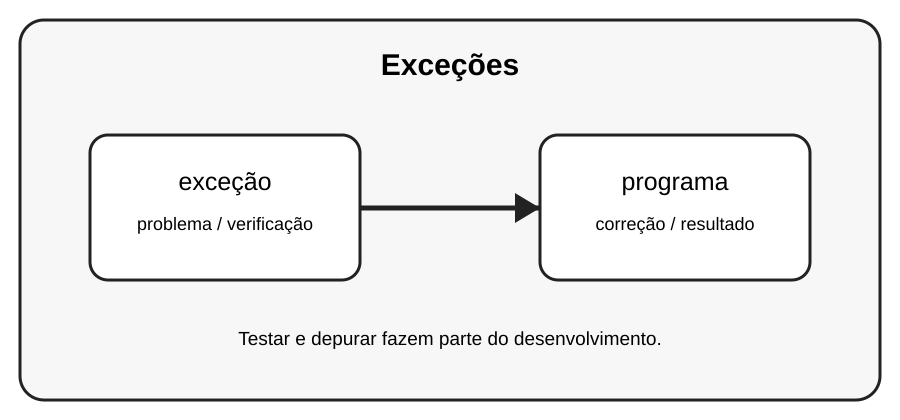

# Aula 2 — Exceções

**Assinatura:** Domingos Ferraz Fonseca

## 1. Entendendo a ideia

Exceções são problemas que acontecem durante a execução. Exemplos comuns incluem ValueError, TypeError, IndexError e KeyError.

## 2. Exemplo prático

~~~python
numero = int("abc")
~~~

Leia a mensagem de erro com calma. Um erro não é uma derrota: é uma pista que ajuda a descobrir o que precisa ser corrigido.

## 3. Exercício guiado

1. Identifique a exceção. 2. Leia o nome e a mensagem. 3. Descubra qual operação causou o problema.

## 4. Exercícios

1. Explique o conceito principal com suas palavras.
2. Modifique o exemplo e observe o resultado.
3. Crie um segundo exemplo usando exceção.
4. Explique como programa participa da solução.

## 5. Desafio

Crie exemplos de três tipos diferentes de exceção e explique cada um.

## 6. Boas práticas

- Leia o traceback antes de mudar o código.
- Corrija uma coisa de cada vez.
- Faça testes pequenos.
- Use nomes claros.
- Não esconda erros com except genérico sem necessidade.
- Teste também casos limite e entradas inválidas.

## 7. Revisão

- Qual foi o erro mais importante desta aula?
- Como você encontrou a causa?
- Como poderia testar a solução?
- Consegue explicar o conceito sem consultar o material?

