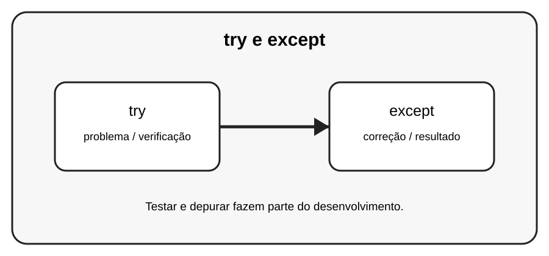

# Aula 3 — try e except

**Assinatura:** Domingos Ferraz Fonseca

## 1. Entendendo a ideia

try permite colocar uma operação que pode falhar; except permite tratar uma exceção esperada.

## 2. Exemplo prático

~~~python
try:
    idade = int(input("Idade: "))
    print(idade)
except ValueError:
    print("Digite um número válido.")
~~~

Leia a mensagem de erro com calma. Um erro não é uma derrota: é uma pista que ajuda a descobrir o que precisa ser corrigido.

## 3. Exercício guiado

1. Teste uma entrada válida. 2. Teste uma entrada inválida. 3. Capture apenas a exceção que você sabe tratar.

## 4. Exercícios

1. Explique o conceito principal com suas palavras.
2. Modifique o exemplo e observe o resultado.
3. Crie um segundo exemplo usando try.
4. Explique como except participa da solução.

## 5. Desafio

Crie um conversor de números que não quebre com entrada inválida.

## 6. Boas práticas

- Leia o traceback antes de mudar o código.
- Corrija uma coisa de cada vez.
- Faça testes pequenos.
- Use nomes claros.
- Não esconda erros com except genérico sem necessidade.
- Teste também casos limite e entradas inválidas.

## 7. Revisão

- Qual foi o erro mais importante desta aula?
- Como você encontrou a causa?
- Como poderia testar a solução?
- Consegue explicar o conceito sem consultar o material?

