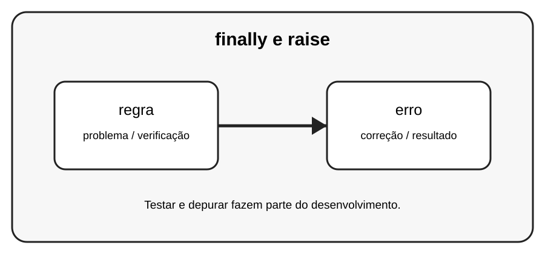

# Aula 4 — finally e raise

**Assinatura:** Domingos Ferraz Fonseca

## 1. Entendendo a ideia

finally executa a parte final de um bloco de tratamento. raise permite provocar uma exceção de propósito quando uma regra do programa não é respeitada.

## 2. Exemplo prático

~~~python
def dividir(a, b):
    if b == 0:
        raise ValueError("O divisor não pode ser zero.")
    return a / b

try:
    print(dividir(10, 0))
except ValueError as erro:
    print(erro)
~~~

Leia a mensagem de erro com calma. Um erro não é uma derrota: é uma pista que ajuda a descobrir o que precisa ser corrigido.

## 3. Exercício guiado

1. Teste uma divisão válida. 2. Teste divisor zero. 3. Crie uma regra própria usando raise.

## 4. Exercícios

1. Explique o conceito principal com suas palavras.
2. Modifique o exemplo e observe o resultado.
3. Crie um segundo exemplo usando regra.
4. Explique como erro participa da solução.

## 5. Desafio

Crie uma função que valide uma idade e lance um erro para valores inválidos.

## 6. Boas práticas

- Leia o traceback antes de mudar o código.
- Corrija uma coisa de cada vez.
- Faça testes pequenos.
- Use nomes claros.
- Não esconda erros com except genérico sem necessidade.
- Teste também casos limite e entradas inválidas.

## 7. Revisão

- Qual foi o erro mais importante desta aula?
- Como você encontrou a causa?
- Como poderia testar a solução?
- Consegue explicar o conceito sem consultar o material?

