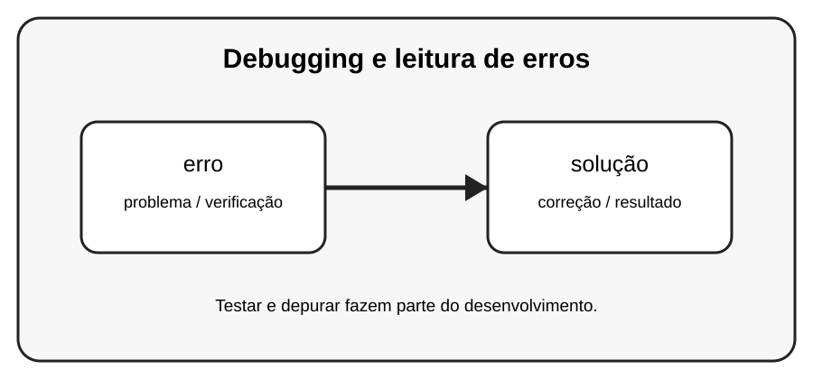

# Aula 5 — Debugging e leitura de erros

**Assinatura:** Domingos Ferraz Fonseca

## 1. Entendendo a ideia

Debugging é o processo de encontrar e corrigir problemas. Uma técnica importante é ler o traceback de baixo para cima, localizar o tipo do erro e investigar os valores envolvidos.

## 2. Exemplo prático

~~~python
def calcular_media(a, b):
    return a + b / 2

print(calcular_media(10, 20))
~~~

Leia a mensagem de erro com calma. Um erro não é uma derrota: é uma pista que ajuda a descobrir o que precisa ser corrigido.

## 3. Exercício guiado

1. Descubra se o resultado está correto. 2. Use parênteses se necessário. 3. Adicione prints temporários para investigar valores.

## 4. Exercícios

1. Explique o conceito principal com suas palavras.
2. Modifique o exemplo e observe o resultado.
3. Crie um segundo exemplo usando erro.
4. Explique como solução participa da solução.

## 5. Desafio

Encontre e corrija três bugs em pequenos programas seus.

## 6. Boas práticas

- Leia o traceback antes de mudar o código.
- Corrija uma coisa de cada vez.
- Faça testes pequenos.
- Use nomes claros.
- Não esconda erros com except genérico sem necessidade.
- Teste também casos limite e entradas inválidas.

## 7. Revisão

- Qual foi o erro mais importante desta aula?
- Como você encontrou a causa?
- Como poderia testar a solução?
- Consegue explicar o conceito sem consultar o material?

