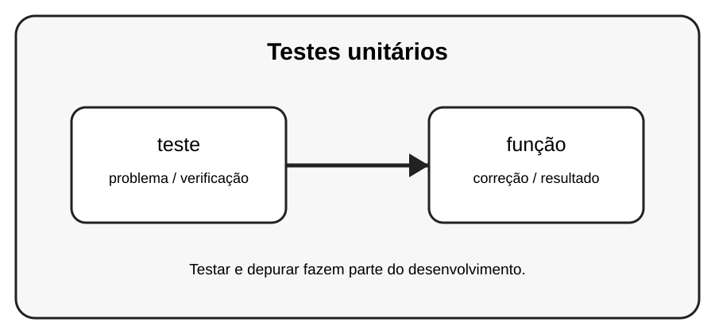

# Aula 6 — Testes unitários

**Assinatura:** Domingos Ferraz Fonseca

## 1. Entendendo a ideia

Um teste unitário verifica uma pequena parte do programa, geralmente uma função, usando entradas conhecidas e resultados esperados.

## 2. Exemplo prático

~~~python
def dobro(n):
    return n * 2

assert dobro(4) == 8
assert dobro(0) == 0
~~~

Leia a mensagem de erro com calma. Um erro não é uma derrota: é uma pista que ajuda a descobrir o que precisa ser corrigido.

## 3. Exercício guiado

1. Crie uma função simples. 2. Defina dois resultados esperados. 3. Escreva testes para eles.

## 4. Exercícios

1. Explique o conceito principal com suas palavras.
2. Modifique o exemplo e observe o resultado.
3. Crie um segundo exemplo usando teste.
4. Explique como função participa da solução.

## 5. Desafio

Crie testes para uma função de cálculo de média.

## 6. Boas práticas

- Leia o traceback antes de mudar o código.
- Corrija uma coisa de cada vez.
- Faça testes pequenos.
- Use nomes claros.
- Não esconda erros com except genérico sem necessidade.
- Teste também casos limite e entradas inválidas.

## 7. Revisão

- Qual foi o erro mais importante desta aula?
- Como você encontrou a causa?
- Como poderia testar a solução?
- Consegue explicar o conceito sem consultar o material?

