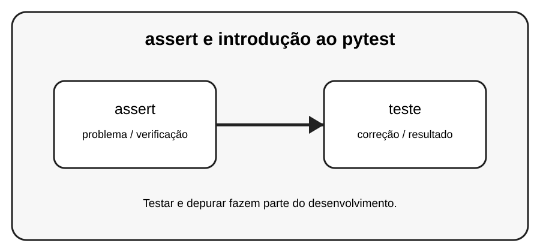

# Aula 7 — assert e introdução ao pytest

**Assinatura:** Domingos Ferraz Fonseca

## 1. Entendendo a ideia

assert verifica uma condição e falha quando ela não é verdadeira. pytest é uma ferramenta popular para organizar e executar testes Python.

## 2. Exemplo prático

~~~python
def somar(a, b):
    return a + b

def test_somar():
    assert somar(2, 3) == 5
~~~

Leia a mensagem de erro com calma. Um erro não é uma derrota: é uma pista que ajuda a descobrir o que precisa ser corrigido.

## 3. Exercício guiado

1. Escreva uma função test_. 2. Coloque assert dentro dela. 3. Execute os testes quando o pytest estiver instalado.

## 4. Exercícios

1. Explique o conceito principal com suas palavras.
2. Modifique o exemplo e observe o resultado.
3. Crie um segundo exemplo usando assert.
4. Explique como teste participa da solução.

## 5. Desafio

Crie uma pequena coleção de testes para um módulo de calculadora.

## 6. Boas práticas

- Leia o traceback antes de mudar o código.
- Corrija uma coisa de cada vez.
- Faça testes pequenos.
- Use nomes claros.
- Não esconda erros com except genérico sem necessidade.
- Teste também casos limite e entradas inválidas.

## 7. Revisão

- Qual foi o erro mais importante desta aula?
- Como você encontrou a causa?
- Como poderia testar a solução?
- Consegue explicar o conceito sem consultar o material?

