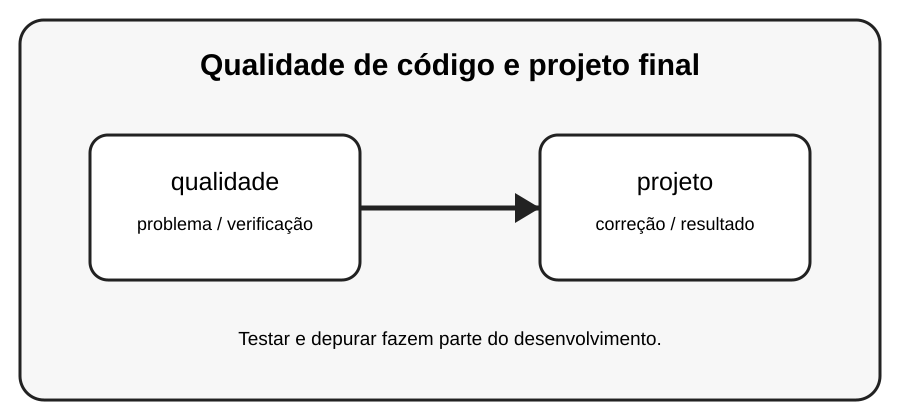

# Aula 8 — Qualidade de código e projeto final

**Assinatura:** Domingos Ferraz Fonseca

## 1. Entendendo a ideia

Código de qualidade não é apenas código que funciona. Também deve ser compreensível, testável, organizado e fácil de manter.

## 2. Exemplo prático

~~~python
def somar(a, b):
    return a + b

# Função pequena, nome claro e comportamento fácil de testar.
~~~

Leia a mensagem de erro com calma. Um erro não é uma derrota: é uma pista que ajuda a descobrir o que precisa ser corrigido.

## 3. Exercício guiado

1. Melhore nomes de variáveis. 2. Divida funções grandes. 3. Remova repetição. 4. Adicione testes.

## 4. Exercícios

1. Explique o conceito principal com suas palavras.
2. Modifique o exemplo e observe o resultado.
3. Crie um segundo exemplo usando qualidade.
4. Explique como projeto participa da solução.

## 5. Desafio

Refatore um pequeno projeto anterior e entregue uma versão com módulos, tratamento de erros e testes.

## 6. Boas práticas

- Leia o traceback antes de mudar o código.
- Corrija uma coisa de cada vez.
- Faça testes pequenos.
- Use nomes claros.
- Não esconda erros com except genérico sem necessidade.
- Teste também casos limite e entradas inválidas.

## 7. Revisão

- Qual foi o erro mais importante desta aula?
- Como você encontrou a causa?
- Como poderia testar a solução?
- Consegue explicar o conceito sem consultar o material?

