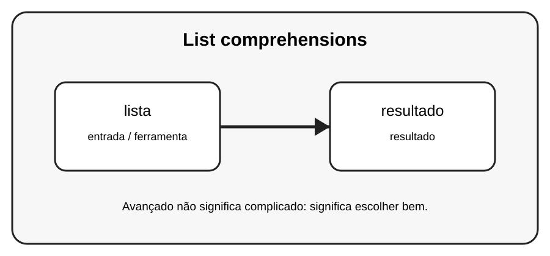

# Aula 1 — List comprehensions

**Assinatura:** Domingos Ferraz Fonseca

## 1. Entendendo a ideia

List comprehension é uma forma compacta de construir listas a partir de sequências. Ela é útil quando deixa o código mais claro.

## 2. Exemplo prático

~~~python
quadrados = [n * n for n in range(6)]
print(quadrados)
~~~

Recursos avançados devem melhorar o programa. Se uma solução simples for mais clara, prefira a solução simples.

## 3. Exercício guiado

1. Faça uma lista de números pares. 2. Depois transforme cada número. 3. Compare com um for tradicional.

## 4. Exercícios

1. Explique lista com suas próprias palavras.
2. Modifique o exemplo e observe o resultado.
3. Crie um segundo exemplo relacionado a resultado.
4. Reescreva uma solução de outra forma e compare a legibilidade.

## 5. Desafio

Crie uma lista com os quadrados dos números pares de 0 a 20.

## 6. Boas práticas

- Prefira clareza a código excessivamente compacto.
- Use nomes que expliquem a intenção.
- Não use uma ferramenta avançada só porque ela existe.
- Teste comportamentos importantes.
- Observe consumo de memória quando trabalhar com grandes sequências.

## 7. Revisão

- Qual problema este recurso resolve?
- Quando você escolheria uma solução mais simples?
- Consegue explicar o código linha por linha?
- Consegue criar um exemplo sem copiar?

