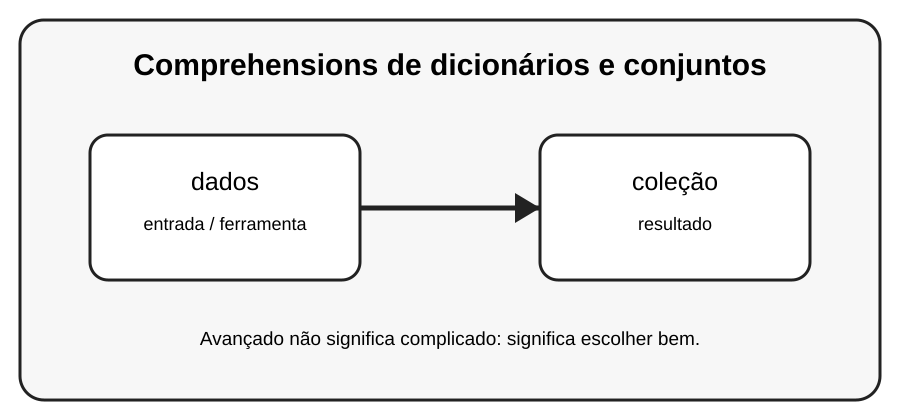

# Aula 2 — Comprehensions de dicionários e conjuntos

**Assinatura:** Domingos Ferraz Fonseca

## 1. Entendendo a ideia

Também podemos construir dicionários e conjuntos com comprehensions. A ideia é produzir uma coleção nova a partir de outra sequência.

## 2. Exemplo prático

~~~python
quadrados = {n: n * n for n in range(5)}
pares = {n for n in range(10) if n % 2 == 0}
print(quadrados)
print(pares)
~~~

Recursos avançados devem melhorar o programa. Se uma solução simples for mais clara, prefira a solução simples.

## 3. Exercício guiado

1. Crie um dicionário de números e quadrados. 2. Crie um conjunto de números pares. 3. Use uma condição.

## 4. Exercícios

1. Explique dados com suas próprias palavras.
2. Modifique o exemplo e observe o resultado.
3. Crie um segundo exemplo relacionado a coleção.
4. Reescreva uma solução de outra forma e compare a legibilidade.

## 5. Desafio

Crie um dicionário que conte características de uma lista de palavras.

## 6. Boas práticas

- Prefira clareza a código excessivamente compacto.
- Use nomes que expliquem a intenção.
- Não use uma ferramenta avançada só porque ela existe.
- Teste comportamentos importantes.
- Observe consumo de memória quando trabalhar com grandes sequências.

## 7. Revisão

- Qual problema este recurso resolve?
- Quando você escolheria uma solução mais simples?
- Consegue explicar o código linha por linha?
- Consegue criar um exemplo sem copiar?

