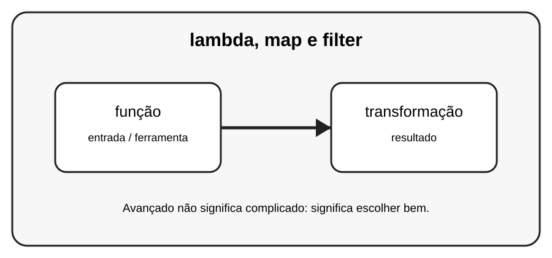

# Aula 3 — lambda, map e filter

**Assinatura:** Domingos Ferraz Fonseca

## 1. Entendendo a ideia

lambda cria funções pequenas. map transforma elementos e filter seleciona elementos. Em Python moderno, muitas vezes uma comprehension é mais legível.

## 2. Exemplo prático

~~~python
numeros = [1, 2, 3, 4]
dobros = list(map(lambda n: n * 2, numeros))
pares = list(filter(lambda n: n % 2 == 0, numeros))
print(dobros)
print(pares)
~~~

Recursos avançados devem melhorar o programa. Se uma solução simples for mais clara, prefira a solução simples.

## 3. Exercício guiado

1. Use lambda para uma operação simples. 2. Teste map. 3. Teste filter. 4. Reescreva usando comprehension.

## 4. Exercícios

1. Explique função com suas próprias palavras.
2. Modifique o exemplo e observe o resultado.
3. Crie um segundo exemplo relacionado a transformação.
4. Reescreva uma solução de outra forma e compare a legibilidade.

## 5. Desafio

Crie uma transformação e um filtro para uma lista de notas.

## 6. Boas práticas

- Prefira clareza a código excessivamente compacto.
- Use nomes que expliquem a intenção.
- Não use uma ferramenta avançada só porque ela existe.
- Teste comportamentos importantes.
- Observe consumo de memória quando trabalhar com grandes sequências.

## 7. Revisão

- Qual problema este recurso resolve?
- Quando você escolheria uma solução mais simples?
- Consegue explicar o código linha por linha?
- Consegue criar um exemplo sem copiar?

