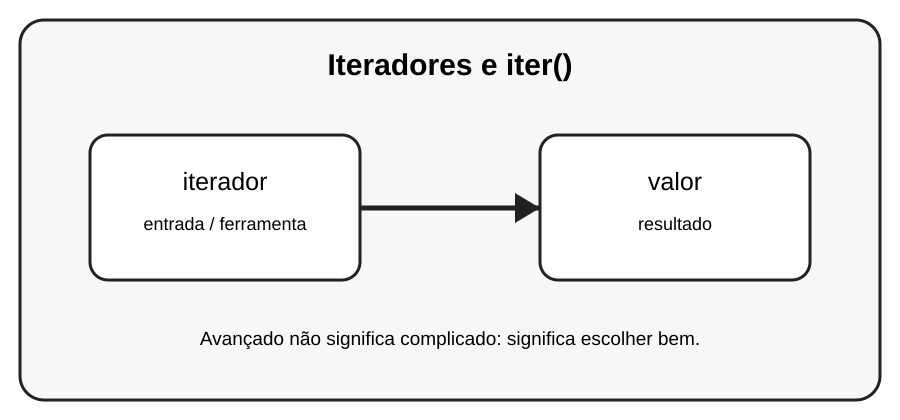

# Aula 4 — Iteradores e iter()

**Assinatura:** Domingos Ferraz Fonseca

## 1. Entendendo a ideia

Um iterador fornece valores um de cada vez. iter() obtém um iterador e next() pede o próximo valor.

## 2. Exemplo prático

~~~python
nomes = ["Ana", "Rui", "Lia"]
it = iter(nomes)
print(next(it))
print(next(it))
~~~

Recursos avançados devem melhorar o programa. Se uma solução simples for mais clara, prefira a solução simples.

## 3. Exercício guiado

1. Crie um iterador. 2. Chame next várias vezes. 3. Observe quando os valores terminam.

## 4. Exercícios

1. Explique iterador com suas próprias palavras.
2. Modifique o exemplo e observe o resultado.
3. Crie um segundo exemplo relacionado a valor.
4. Reescreva uma solução de outra forma e compare a legibilidade.

## 5. Desafio

Crie uma função que percorra um iterador com segurança.

## 6. Boas práticas

- Prefira clareza a código excessivamente compacto.
- Use nomes que expliquem a intenção.
- Não use uma ferramenta avançada só porque ela existe.
- Teste comportamentos importantes.
- Observe consumo de memória quando trabalhar com grandes sequências.

## 7. Revisão

- Qual problema este recurso resolve?
- Quando você escolheria uma solução mais simples?
- Consegue explicar o código linha por linha?
- Consegue criar um exemplo sem copiar?

