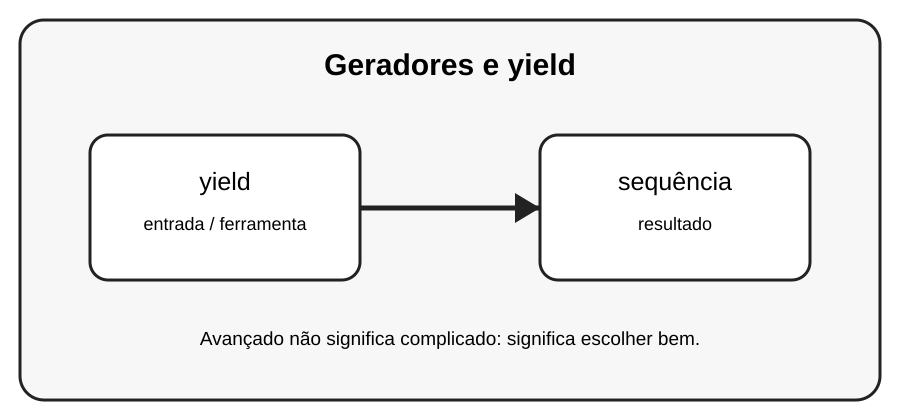

# Aula 5 — Geradores e yield

**Assinatura:** Domingos Ferraz Fonseca

## 1. Entendendo a ideia

Um gerador produz valores sob demanda. A palavra yield pausa a função e permite continuar depois, evitando criar toda a sequência de uma vez.

## 2. Exemplo prático

~~~python
def contar(limite):
    for n in range(limite):
        yield n

for valor in contar(5):
    print(valor)
~~~

Recursos avançados devem melhorar o programa. Se uma solução simples for mais clara, prefira a solução simples.

## 3. Exercício guiado

1. Crie um gerador de números. 2. Use yield. 3. Percorra com for. 4. Compare com uma lista.

## 4. Exercícios

1. Explique yield com suas próprias palavras.
2. Modifique o exemplo e observe o resultado.
3. Crie um segundo exemplo relacionado a sequência.
4. Reescreva uma solução de outra forma e compare a legibilidade.

## 5. Desafio

Crie um gerador que produza apenas números pares até um limite.

## 6. Boas práticas

- Prefira clareza a código excessivamente compacto.
- Use nomes que expliquem a intenção.
- Não use uma ferramenta avançada só porque ela existe.
- Teste comportamentos importantes.
- Observe consumo de memória quando trabalhar com grandes sequências.

## 7. Revisão

- Qual problema este recurso resolve?
- Quando você escolheria uma solução mais simples?
- Consegue explicar o código linha por linha?
- Consegue criar um exemplo sem copiar?

