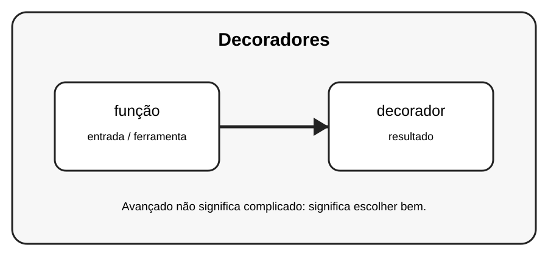

# Aula 6 — Decoradores

**Assinatura:** Domingos Ferraz Fonseca

## 1. Entendendo a ideia

Um decorador envolve uma função para acrescentar comportamento sem alterar diretamente o corpo original da função.

## 2. Exemplo prático

~~~python
def registrar(funcao):
    def interna():
        print("Executando...")
        funcao()
    return interna

@registrar
def ola():
    print("Olá!")

ola()
~~~

Recursos avançados devem melhorar o programa. Se uma solução simples for mais clara, prefira a solução simples.

## 3. Exercício guiado

1. Leia o decorador por partes. 2. Identifique a função original. 3. Veja o que interna acrescenta.

## 4. Exercícios

1. Explique função com suas próprias palavras.
2. Modifique o exemplo e observe o resultado.
3. Crie um segundo exemplo relacionado a decorador.
4. Reescreva uma solução de outra forma e compare a legibilidade.

## 5. Desafio

Crie um decorador simples que mostre uma mensagem antes de executar uma função.

## 6. Boas práticas

- Prefira clareza a código excessivamente compacto.
- Use nomes que expliquem a intenção.
- Não use uma ferramenta avançada só porque ela existe.
- Teste comportamentos importantes.
- Observe consumo de memória quando trabalhar com grandes sequências.

## 7. Revisão

- Qual problema este recurso resolve?
- Quando você escolheria uma solução mais simples?
- Consegue explicar o código linha por linha?
- Consegue criar um exemplo sem copiar?

