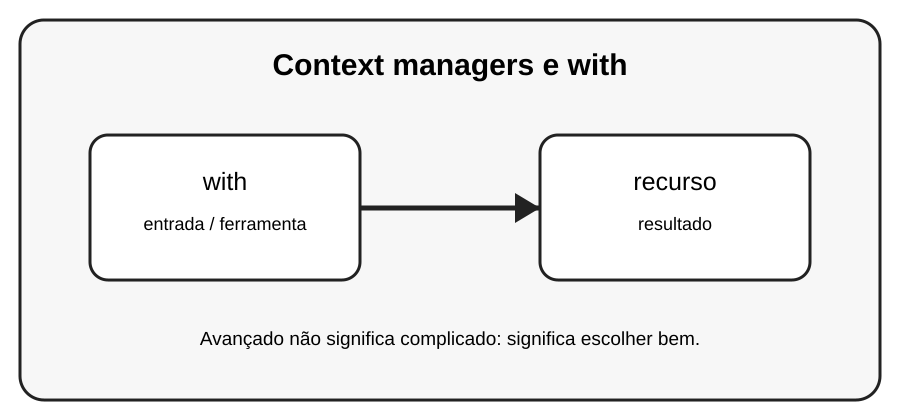

# Aula 7 — Context managers e with

**Assinatura:** Domingos Ferraz Fonseca

## 1. Entendendo a ideia

Context managers ajudam a preparar e liberar recursos corretamente. A instrução with é o exemplo mais comum e é muito usada com arquivos e conexões.

## 2. Exemplo prático

~~~python
with open("dados.txt", "w", encoding="utf-8") as arquivo:
    arquivo.write("Olá")
~~~

Recursos avançados devem melhorar o programa. Se uma solução simples for mais clara, prefira a solução simples.

## 3. Exercício guiado

1. Use with com um arquivo. 2. Explique por que ele é melhor que esquecer close(). 3. Observe o bloco de indentação.

## 4. Exercícios

1. Explique with com suas próprias palavras.
2. Modifique o exemplo e observe o resultado.
3. Crie um segundo exemplo relacionado a recurso.
4. Reescreva uma solução de outra forma e compare a legibilidade.

## 5. Desafio

Crie um pequeno exemplo que use with para trabalhar com um recurso.

## 6. Boas práticas

- Prefira clareza a código excessivamente compacto.
- Use nomes que expliquem a intenção.
- Não use uma ferramenta avançada só porque ela existe.
- Teste comportamentos importantes.
- Observe consumo de memória quando trabalhar com grandes sequências.

## 7. Revisão

- Qual problema este recurso resolve?
- Quando você escolheria uma solução mais simples?
- Consegue explicar o código linha por linha?
- Consegue criar um exemplo sem copiar?

