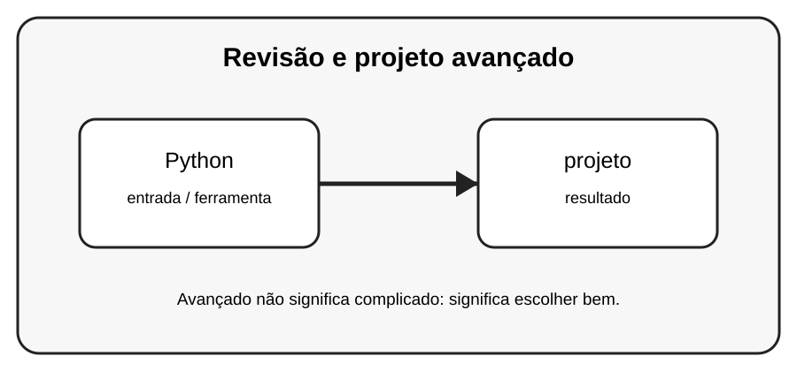

# Aula 8 — Revisão e projeto avançado

**Assinatura:** Domingos Ferraz Fonseca

## 1. Entendendo a ideia

Agora vamos combinar recursos avançados com funções, módulos, tratamento de erros e testes. O objetivo é escolher a ferramenta certa, não usar recursos avançados apenas para deixar o código complicado.

## 2. Exemplo prático

~~~python
def positivos(numeros):
    return (n for n in numeros if n > 0)

valores = [-2, 0, 3, 5]
for valor in positivos(valores):
    print(valor)
~~~

Recursos avançados devem melhorar o programa. Se uma solução simples for mais clara, prefira a solução simples.

## 3. Exercício guiado

1. Refaça o exemplo com comprehension. 2. Depois use gerador. 3. Compare clareza e consumo de dados. 4. Escreva um teste.

## 4. Exercícios

1. Explique Python com suas próprias palavras.
2. Modifique o exemplo e observe o resultado.
3. Crie um segundo exemplo relacionado a projeto.
4. Reescreva uma solução de outra forma e compare a legibilidade.

## 5. Desafio

Crie um mini projeto que use pelo menos três recursos deste volume e explique por que escolheu cada um.

## 6. Boas práticas

- Prefira clareza a código excessivamente compacto.
- Use nomes que expliquem a intenção.
- Não use uma ferramenta avançada só porque ela existe.
- Teste comportamentos importantes.
- Observe consumo de memória quando trabalhar com grandes sequências.

## 7. Revisão

- Qual problema este recurso resolve?
- Quando você escolheria uma solução mais simples?
- Consegue explicar o código linha por linha?
- Consegue criar um exemplo sem copiar?

