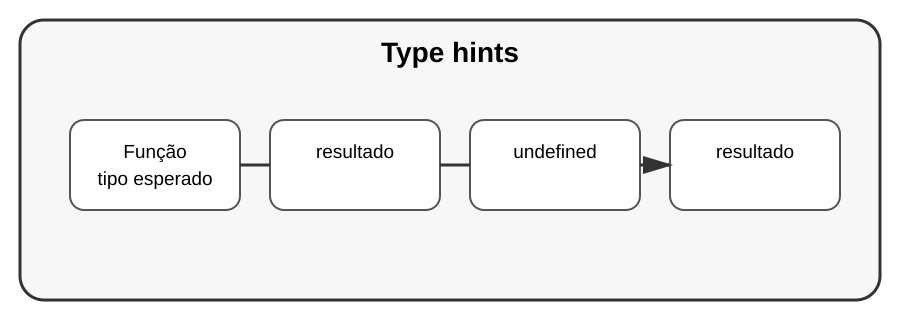

# Aula 1 — Type Hints: dizendo quais tipos esperamos

**Assinatura:** Domingos Ferraz Fonseca

## 1. O que são Type Hints?

Type hints são anotações que ajudam a indicar que tipo de dado uma função espera receber e devolver.

~~~python
def somar(a: int, b: int) -> int:
    return a + b
~~~

Aqui, `a` e `b` são esperados como inteiros e o resultado é indicado como inteiro.

## 2. Por que usar?

Type hints tornam o código mais fácil de entender e ajudam editores e ferramentas a encontrar problemas.

~~~python
def apresentar(nome: str, idade: int) -> str:
    return f"{nome} tem {idade} anos."
~~~

Type hints não são uma barreira automática. Python continua sendo uma linguagem dinâmica.

## 3. Variáveis com tipos anotados

~~~python
nome: str = "Ana"
idade: int = 12
altura: float = 1.55
ativo: bool = True
~~~

Também podemos anotar listas:

~~~python
idades: list[int] = [10, 12, 14]
nomes: list[str] = ["Ana", "João"]
~~~

## Exercício guiado

Crie uma função que receba o preço de um produto e a quantidade e devolva o total.

~~~python
def calcular_total(preco: float, quantidade: int) -> float:
    return preco * quantidade
~~~

Teste:

~~~python
print(calcular_total(12.5, 3))
~~~

## Exercícios

1. Crie `dobro(numero: int) -> int`.
2. Crie `saudacao(nome: str) -> str`.
3. Crie uma variável `notas` anotada como `list[float]`.
4. Crie uma função que receba uma lista de inteiros e devolva a soma.

## Desafio

Crie uma função `media` que receba `list[float]` e devolva um `float`.

## Boas práticas

- Use nomes claros.
- Use type hints em funções importantes.
- Não pense que uma anotação substitui testes.
- Mantenha as anotações coerentes com o comportamento real.

## Revisão

Type hints documentam expectativas sobre os dados e ajudam ferramentas de desenvolvimento. Elas tornam projetos maiores mais fáceis de compreender e manter.
