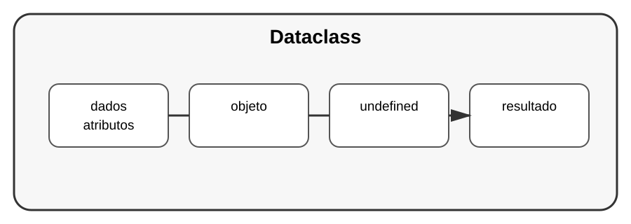

# Aula 2 — Dataclasses

**Assinatura:** Domingos Ferraz Fonseca

## 1. O problema

Imagine uma classe simples para guardar dados de uma pessoa:

~~~python
class Pessoa:
    def __init__(self, nome: str, idade: int):
        self.nome = nome
        self.idade = idade
~~~

Isto funciona muito bem. Mas existem classes cujo principal objetivo é simplesmente guardar dados.

Para esses casos, `dataclass` pode reduzir código repetitivo.

## 2. Criando uma dataclass

~~~python
from dataclasses import dataclass

@dataclass
class Pessoa:
    nome: str
    idade: int
~~~

Agora podemos criar objetos:

~~~python
pessoa = Pessoa("Ana", 12)
print(pessoa)
~~~

A dataclass cria automaticamente comportamentos úteis, como uma representação do objeto e inicialização dos campos.

## 3. Valores padrão

~~~python
@dataclass
class Produto:
    nome: str
    preco: float
    quantidade: int = 0
~~~

Podemos escrever:

~~~python
produto = Produto("Caderno", 10.5)
print(produto.quantidade)
~~~

## Exercício guiado

Crie uma dataclass chamada `Aluno`.

~~~python
from dataclasses import dataclass

@dataclass
class Aluno:
    nome: str
    idade: int
    nota: float
~~~

Crie dois alunos e mostre os dados.

## Exercícios

1. Crie uma dataclass `Livro`.
2. Crie uma dataclass `Produto` com preço padrão de 0.
3. Crie três objetos de uma dataclass.
4. Mostre os objetos usando `print()`.

## Desafio

Crie uma dataclass `Tarefa` com título, prioridade e estado. Depois crie uma pequena lista de tarefas.

## Boas práticas

- Use dataclasses quando a classe representa principalmente dados.
- Use type hints nos campos.
- Não use dataclass só porque ela existe; escolha a ferramenta de acordo com o problema.

## Revisão

Uma dataclass é uma forma prática de criar classes orientadas para dados, reduzindo código repetitivo e deixando a intenção do modelo mais clara.
