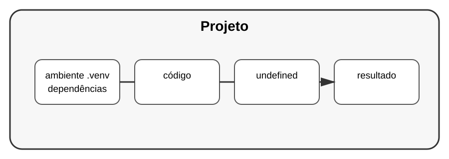

# Aula 3 — Ambientes virtuais com venv

**Assinatura:** Domingos Ferraz Fonseca

## 1. Por que separar ambientes?

Projetos diferentes podem precisar de versões diferentes de bibliotecas.

Um ambiente virtual cria um espaço isolado para as dependências de um projeto.

## 2. Criando um ambiente

No terminal, dentro da pasta do projeto:

~~~bash
python -m venv .venv
~~~

Isso cria uma pasta chamada `.venv`.

Para ativar no Windows PowerShell:

~~~powershell
.venv\Scripts\Activate.ps1
~~~

Em Linux ou macOS:

~~~bash
source .venv/bin/activate
~~~

O comando exato pode variar conforme o sistema.

## 3. Instalando pacotes

Com o ambiente ativo:

~~~bash
python -m pip install requests
~~~

Assim, a biblioteca é instalada no ambiente do projeto.

## 4. Desativando

Quando terminar:

~~~bash
deactivate
~~~

## Exercício guiado

Crie uma pasta para um pequeno projeto e, dentro dela, crie um ambiente `.venv`.

Depois confirme que o ambiente foi criado.

## Exercícios

1. Crie um ambiente virtual chamado `.venv`.
2. Ative-o.
3. Instale uma biblioteca necessária para um projeto de estudo.
4. Desative o ambiente.

## Desafio

Crie um projeto simples que use uma biblioteca externa e mantenha o ambiente separado do restante do computador.

## Boas práticas

- Normalmente, não coloque `.venv` no Git.
- Use um ambiente por projeto quando fizer sentido.
- Prefira `python -m pip` para deixar claro qual Python está sendo usado.

## Revisão

Ambientes virtuais ajudam a manter as dependências de cada projeto separadas. Isso reduz conflitos e torna projetos mais organizados.
