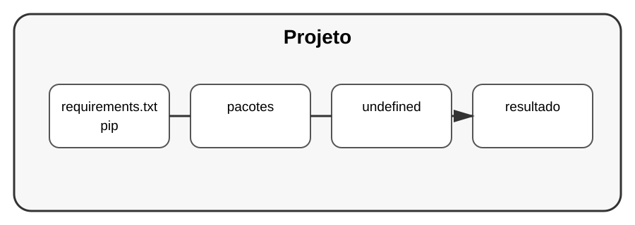

# Aula 4 — Dependências e pip

**Assinatura:** Domingos Ferraz Fonseca

## 1. O que é uma dependência?

Uma dependência é algo de que o nosso programa precisa para funcionar.

Por exemplo, um projeto pode depender da biblioteca `requests`.

## 2. pip

O `pip` é uma ferramenta usada para instalar pacotes Python.

~~~bash
python -m pip install requests
~~~

Para atualizar:

~~~bash
python -m pip install --upgrade requests
~~~

Para remover:

~~~bash
python -m pip uninstall requests
~~~

## 3. requirements.txt

Uma forma tradicional de registrar dependências é o arquivo `requirements.txt`.

Exemplo:

~~~text
requests
pytest
~~~

Depois:

~~~bash
python -m pip install -r requirements.txt
~~~

## 4. Ver o que está instalado

~~~bash
python -m pip list
~~~

Também podemos gerar uma lista:

~~~bash
python -m pip freeze > requirements.txt
~~~

O resultado representa o ambiente instalado naquele momento.

## Exercício guiado

Crie um projeto, instale uma biblioteca de que ele realmente precise e registre a dependência em um arquivo.

## Exercícios

1. Explique o que é uma dependência.
2. Instale um pacote em um ambiente virtual.
3. Crie um `requirements.txt`.
4. Instale dependências usando `-r`.

## Desafio

Monte uma pequena aplicação com ambiente virtual e arquivo de dependências. Escreva no README como outra pessoa pode preparar o projeto.

## Boas práticas

- Evite instalar pacotes sem necessidade.
- Registre as dependências do projeto.
- Use ambiente virtual.
- Leia a documentação das bibliotecas usadas.

## Revisão

Gerir dependências é parte importante de um projeto profissional. O objetivo é tornar claro o que o projeto precisa para funcionar.
