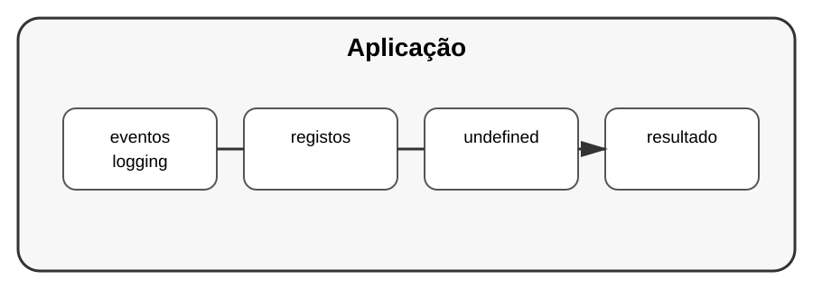

# Aula 5 — Logging

**Assinatura:** Domingos Ferraz Fonseca

## 1. O que é logging?

Durante o desenvolvimento, usamos `print()` muitas vezes. Em aplicações maiores, porém, é útil ter um sistema organizado de registos.

Python possui o módulo `logging`.

## 2. Primeiro exemplo

~~~python
import logging

logging.basicConfig(level=logging.INFO)

logging.info("Programa iniciado")
logging.warning("Isto merece atenção")
~~~

Existem diferentes níveis, como:

- DEBUG
- INFO
- WARNING
- ERROR
- CRITICAL

## 3. Logger

Em projetos maiores, podemos criar um logger:

~~~python
import logging

logger = logging.getLogger(__name__)

logger.info("Utilizador criado")
logger.error("Não foi possível concluir a operação")
~~~

## 4. Logging não é apenas print

O logging pode ser configurado para enviar mensagens para diferentes destinos e formatos.

Isso é muito útil para investigar problemas sem alterar o fluxo normal do programa.

## Exercício guiado

Crie um programa que registe:

1. início;
2. uma operação concluída;
3. um aviso;
4. um erro tratado.

## Exercícios

1. Use `logging.info()`.
2. Use `logging.warning()`.
3. Use `logging.error()`.
4. Crie um logger com `getLogger(__name__)`.

## Desafio

Crie um pequeno sistema de cadastro que registre quando uma pessoa é adicionada e quando ocorre uma entrada inválida.

## Boas práticas

- Use logging para acontecimentos importantes.
- Não registre dados privados sem necessidade.
- Escolha níveis de log coerentes.
- Em aplicações maiores, configure logging de forma centralizada.

## Revisão

Logging é uma ferramenta profissional para observar o comportamento de uma aplicação e ajudar a investigar problemas.
