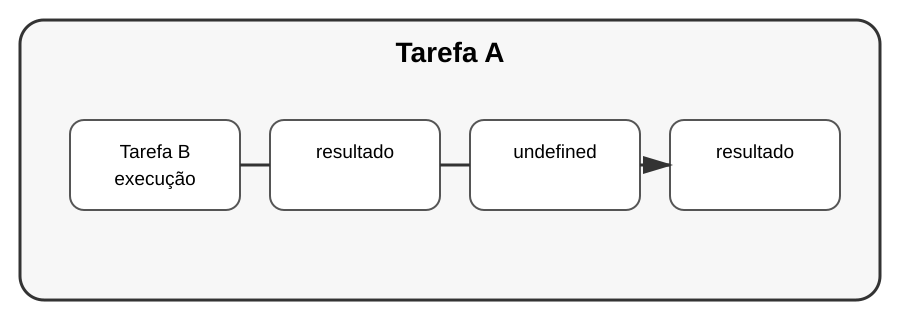

# Aula 6 — Concorrência

**Assinatura:** Domingos Ferraz Fonseca

## 1. O que significa concorrência?

Concorrência significa organizar um programa para lidar com mais de uma tarefa em andamento.

Imagine duas tarefas:

- tarefa A: esperar uma operação;
- tarefa B: fazer outro trabalho enquanto A espera.

## 2. Thread

Python possui `threading` para trabalhar com threads.

~~~python
import threading

def tarefa():
    print("Tarefa executada")

thread = threading.Thread(target=tarefa)
thread.start()
thread.join()

print("Fim")
~~~

`start()` inicia a thread e `join()` espera que ela termine.

## 3. ThreadPoolExecutor

Outra opção prática é:

~~~python
from concurrent.futures import ThreadPoolExecutor

def dobro(numero):
    return numero * 2

with ThreadPoolExecutor(max_workers=2) as executor:
    resultados = list(executor.map(dobro, [1, 2, 3, 4]))

print(resultados)
~~~

## 4. Atenção

Concorrência tem custos e complexidade. Não devemos adicionar threads simplesmente porque parecem mais profissionais.

Para tarefas ligadas a espera de entrada/saída, concorrência pode ser especialmente útil. Para computação pesada, é preciso estudar outras estratégias e as características do Python.

## Exercício guiado

Crie duas funções simples e execute-as usando `ThreadPoolExecutor`.

## Exercícios

1. Crie uma thread.
2. Use `join()`.
3. Use `ThreadPoolExecutor`.
4. Compare uma execução simples com uma execução concorrente em um exemplo apropriado.

## Desafio

Crie um programa que processe vários itens independentes usando um pequeno pool de threads.

## Boas práticas

- Comece pelo código simples.
- Use concorrência quando houver uma razão clara.
- Evite compartilhar estado mutável desnecessariamente.
- Estude sincronização antes de criar programas concorrentes complexos.

## Revisão

Concorrência permite organizar várias tarefas em andamento. É poderosa, mas adiciona complexidade e deve ser usada quando traz benefício real.
