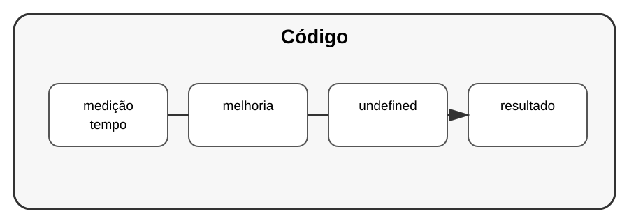

# Aula 7 — Desempenho e medição

**Assinatura:** Domingos Ferraz Fonseca

## 1. Código rápido ou código claro?

Um programa profissional precisa funcionar corretamente e ser fácil de manter. Só depois devemos otimizar partes que realmente precisam de melhoria.

## 2. Medindo tempo

Podemos usar `time.perf_counter()` para medir uma operação:

~~~python
import time

inicio = time.perf_counter()

total = sum(range(1_000_000))

fim = time.perf_counter()

print("Tempo:", fim - inicio)
~~~

## 3. timeit

Para medições pequenas, `timeit` é uma ferramenta útil:

~~~python
import timeit

tempo = timeit.timeit("sum(range(1000))", number=1000)
print(tempo)
~~~

## 4. Complexidade

Também precisamos pensar na quantidade de trabalho.

Uma procura numa lista pode precisar verificar muitos elementos:

~~~python
for item in lista:
    if item == procurado:
        ...
~~~

Escolher a estrutura de dados correta pode fazer uma grande diferença.

## Exercício guiado

Compare duas pequenas soluções para o mesmo problema e meça o tempo. Não tire conclusões com uma única medição.

## Exercícios

1. Use `perf_counter()`.
2. Use `timeit`.
3. Explique por que medir é melhor do que adivinhar.
4. Identifique uma parte do seu projeto que poderia ser medida.

## Desafio

Crie duas soluções para procurar dados e faça uma pequena experiência para comparar o comportamento delas.

## Boas práticas

- Meça antes de otimizar.
- Otimize o que realmente importa.
- Preserve a clareza do código.
- Considere algoritmo e estrutura de dados, não apenas micro-otimizações.

## Revisão

Desempenho profissional começa por medição. Ferramentas como `timeit` e `perf_counter` ajudam a substituir palpites por dados.
