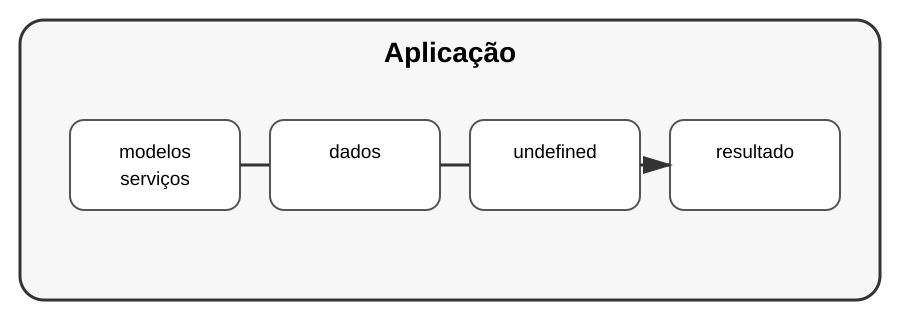

# Aula 8 — Arquitetura, padrões e projeto profissional

**Assinatura:** Domingos Ferraz Fonseca

## 1. Quando o projeto cresce

No início, podemos colocar tudo num único arquivo. Com o crescimento, isso fica difícil de manter.

Uma organização simples pode ser:

~~~text
meu_projeto/
├── app/
│   ├── __init__.py
│   ├── modelos.py
│   ├── servicos.py
│   └── repositorio.py
├── testes/
│   └── test_servicos.py
├── README.md
└── requirements.txt
~~~

## 2. Separar responsabilidades

Uma regra útil é cada parte do programa ter uma responsabilidade clara.

Por exemplo:

- modelos: representam dados;
- serviços: contêm regras de negócio;
- repositório: trata acesso a dados;
- testes: verificam o comportamento.

## 3. Padrões de projeto

Padrões de projeto são soluções recorrentes para problemas recorrentes de design.

Exemplos conhecidos incluem:

- Factory;
- Strategy;
- Observer;
- Adapter.

Não é necessário decorar todos os padrões. É mais importante entender o problema que cada um resolve.

## 4. Projeto final do volume

Crie um **Sistema de Tarefas Profissional** com:

- classes ou dataclasses;
- type hints;
- módulos separados;
- ambiente virtual;
- dependências registradas;
- logging;
- tratamento de erros;
- testes;
- armazenamento em JSON ou SQLite;
- README explicando como executar.

### Organização sugerida

~~~text
sistema_tarefas/
├── app/
│   ├── modelos.py
│   ├── servicos.py
│   └── repositorio.py
├── testes/
├── requirements.txt
└── README.md
~~~

## Exercício guiado

Antes de programar, escreva:

1. Quais dados existem?
2. Quais operações o sistema precisa realizar?
3. Quais módulos serão necessários?
4. Como serão testados?
5. Onde serão guardados os dados?

## Exercícios

1. Separe um programa grande em módulos.
2. Identifique responsabilidades misturadas.
3. Crie testes para uma função importante.
4. Adicione logging a uma operação.

## Desafio

Implemente o Sistema de Tarefas completo e documente as decisões de arquitetura no README.

## Boas práticas

- Prefira simplicidade.
- Separe responsabilidades.
- Escreva testes.
- Documente como executar o projeto.
- Evite padrões só para parecer profissional.
- Faça a arquitetura servir ao problema.

## Revisão final do Volume 10

Agora já conhecemos várias ferramentas usadas em projetos profissionais:

- type hints;
- dataclasses;
- ambientes virtuais;
- dependências;
- logging;
- concorrência;
- medição de desempenho;
- arquitetura e padrões.

O objetivo profissional não é escrever código complicado. É construir software correto, compreensível, testável e sustentável.
