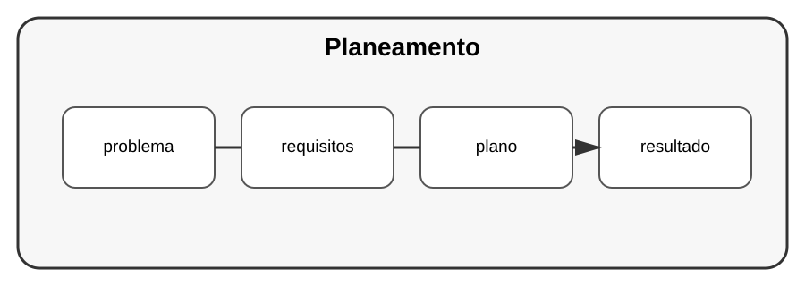

# Aula 1 — Como planear um projeto profissional

**Assinatura:** Domingos Ferraz Fonseca

## 1. Antes de escrever código

Um projeto profissional começa pelo problema, não pelo teclado.

Pergunte:

- Qual problema quero resolver?
- Quem vai usar o programa?
- Quais dados entram?
- Qual resultado deve sair?
- Quais funcionalidades são realmente necessárias?

## 2. Requisitos

Um requisito descreve algo que o sistema precisa fazer.

Exemplo de sistema de tarefas:

- criar tarefa;
- listar tarefas;
- concluir tarefa;
- remover tarefa;
- guardar tarefas.

## 3. MVP

MVP significa criar primeiro uma versão mínima que já resolve o problema principal.

Não precisamos construir vinte funcionalidades no primeiro dia.

## Exercício guiado

Escolha um projeto pequeno e escreva cinco requisitos.

## Exercícios

1. Defina o problema.
2. Defina o utilizador.
3. Liste entradas e saídas.
4. Escolha três funcionalidades essenciais.

## Desafio

Planeie um sistema de biblioteca antes de escrever qualquer código.

## Boas práticas

Planeie o suficiente para começar, mas aceite melhorar o plano conforme aprende.

## Revisão

Um bom projeto nasce de um problema bem definido, requisitos claros e uma primeira versão controlada.
