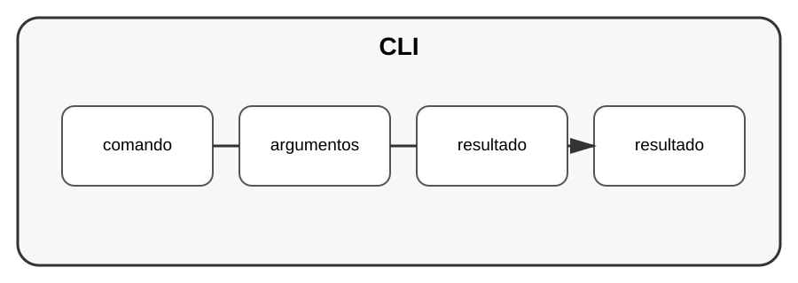

# Aula 2 — Criando aplicações de terminal

**Assinatura:** Domingos Ferraz Fonseca

## 1. O que é uma CLI?

CLI significa Command-Line Interface: uma aplicação controlada pelo terminal.

Python possui o módulo `argparse` para criar interfaces de linha de comando.

~~~python
import argparse

parser = argparse.ArgumentParser()
parser.add_argument("nome")

args = parser.parse_args()

print(f"Olá, {args.nome}!")
~~~

## 2. Subcomandos

Aplicações maiores podem ter comandos como:

~~~text
tarefas adicionar
tarefas listar
tarefas concluir
~~~

O módulo `argparse` permite organizar esse tipo de interface.

## Exercício guiado

Crie uma CLI que receba o nome de uma pessoa.

## Exercícios

1. Adicione um argumento.
2. Adicione um argumento opcional.
3. Mostre uma mensagem de ajuda.
4. Crie dois comandos simples.

## Desafio

Crie uma CLI para gerir tarefas.

## Boas práticas

- Mostre mensagens claras.
- Valide entradas.
- Use nomes de comandos previsíveis.
- Inclua ajuda.

## Revisão

CLIs são úteis para ferramentas, automações e administração de sistemas.
