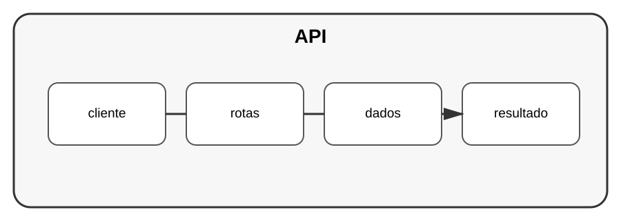

# Aula 3 — Construindo uma API

**Assinatura:** Domingos Ferraz Fonseca

## 1. API de aplicação

Uma API permite que outros programas comuniquem com o nosso sistema.

Uma API de tarefas pode ter:

~~~text
GET    /tarefas
POST   /tarefas
PUT    /tarefas/1
DELETE /tarefas/1
~~~

## 2. Camadas

Uma aplicação pode separar:

- rotas;
- regras de negócio;
- acesso aos dados.

Essa separação facilita testes e manutenção.

## 3. JSON

Uma resposta pode ter:

~~~json
{
  "id": 1,
  "titulo": "Estudar Python",
  "concluida": false
}
~~~

## Exercício guiado

Desenhe as rotas de uma API de livros antes de implementá-las.

## Exercícios

1. Defina uma rota GET.
2. Defina uma rota POST.
3. Defina uma rota DELETE.
4. Defina o formato JSON de uma resposta.

## Desafio

Crie uma pequena API CRUD usando uma framework Python que conheças e documente as rotas.

## Boas práticas

- Valide dados.
- Use códigos HTTP apropriados.
- Separe regras de negócio das rotas.
- Escreva testes.

## Revisão

Uma API profissional precisa de contratos claros, validação, organização e testes.
